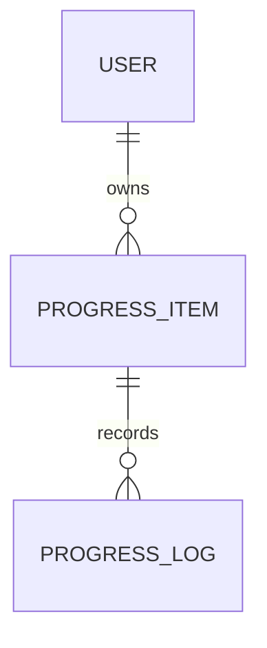

# Daily Progress – Product Requirements Document

> **Progress is acknowledged, not judged.**

---

## 1. Overview

**Product Name:** Daily Progress

**Purpose:**  
Daily Progress helps individuals maintain awareness of ongoing responsibilities and make consistent progress every day — especially on long-term or easily forgotten work.

The product prioritizes:
- daily visibility
- incremental progress
- emotional calm
- memory support

---

## 2. Problem Statement

Traditional todo systems:
- surface items only near deadlines
- treat work as binary (done / not done)
- punish inconsistency with guilt or pressure

For users with:
- many parallel responsibilities
- meetings, routines, and long-term work
- limited mental bandwidth

This leads to forgotten tasks, stress, and avoidance.

---

## 3. Goals & Non-Goals

### Goals
- Make all active responsibilities visible **every day**
- Encourage small, consistent progress
- Blend time-based events and ongoing work
- Support memory through history and notes
- Work reliably across devices

### Non-Goals
- Team collaboration
- Productivity scoring
- Gamification (points, streaks, badges)
- Complex project management

---

## 4. Target User

**Primary user:**
- Individual user (initially personal use)
- Busy adult with multiple daily roles
- Struggles with remembering plans, progress, and context
- Values calm systems over aggressive productivity tools

---

## 5. Core Concept

### Daily-First Model

Instead of asking:
> “What is due soon?”

The app asks:
> **“What deserves progress today?”**

Progress Items remain visible across days until they are **Settled** or **Paused**.

---

## 6. Core Features (Phase 1)

### 6.1 Daily Progress Dashboard

A single daily screen containing:
1. **Today Timeline** (time-anchored)
2. **Eisenhower Matrix** (importance × urgency)
3. **Commitments / Routines**
4. **Daily Reflection**

---

### 6.2 Progress Items

A Progress Item represents something that deserves ongoing attention.

Attributes:
- title
- importance (high / low)
- urgency (high / low)
- optional deadline
- status (active / settled / paused)

---

### 6.3 Progress Logging

At any time during the day, a user can:
- log progress on a Progress Item
- optionally add a short note describing what moved forward

Notes are:
- optional
- short
- append-only
- never scored or analyzed

---

### 6.4 Status Handling

- **Active** → currently relevant
- **Settled** → no longer needs attention
- **Paused** → intentionally inactive

Settled does not imply perfection — only closure.

---

### 6.5 History & Progress Log

The system maintains a read-only log of progress:
- daily view
- weekly summary
- monthly overview

Purpose:
- memory recall
- reflection
- continuity across days and devices

---

### 6.6 Authentication & Sync

- Login required
- Multi-device sync
- Offline-first behavior
- Local data syncs when connection is available

---

## 7. User Flows

### 7.1 Daily Flow

```mermaid
flowchart TD
    A[Open App] --> B[Login]
    B --> C[Daily Progress Dashboard]
    C --> D[Review Timeline]
    C --> E[Review Matrix]
    E --> F[Work on Progress Item]
    F --> G[Log Progress]
    G --> H[Gentle Acknowledgement]
````

---

### 7.2 Progress Logging Flow

```mermaid
sequenceDiagram
    participant U as User
    participant A as App
    participant S as Storage

    U->>A: Log progress
    A-->>U: Optional note input
    U->>A: Save
    A->>S: Append ProgressLog
    A-->>U: Progress acknowledged
```

---

## 8. Data Model (Conceptual)



---

## 9. Technical Requirements

* Progressive Web App (PWA)
* Offline-first architecture
* IndexedDB for local storage
* Cloud sync with simple conflict resolution
* Secure authentication

---

## 10. Success Criteria

Success is defined by:

* daily usefulness
* reduced forgotten responsibilities
* consistent, low-stress engagement

Not by:

* streaks
* task completion rates
* productivity scores

---

## 11. Guiding Principle

> **Progress is acknowledged, not judged.**

If a feature violates this principle, it does not belong in the product.

```