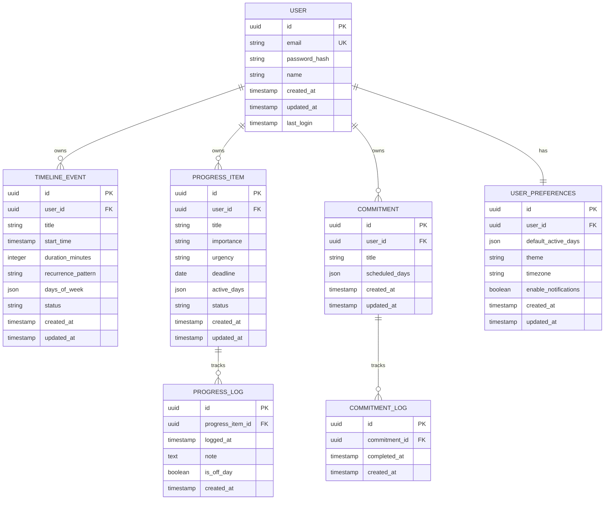

# Daily Progress - Database Schema

This document defines the complete database schema for Daily Progress.

---

## Entity Relationship Diagram



---

## Table Definitions

### 1. USER

Stores user authentication and basic profile information.

```sql
CREATE TABLE users (
    id UUID PRIMARY KEY DEFAULT gen_random_uuid(),
    email VARCHAR(255) UNIQUE NOT NULL,
    password_hash VARCHAR(255) NOT NULL,
    name VARCHAR(255) NOT NULL,
    created_at TIMESTAMP NOT NULL DEFAULT CURRENT_TIMESTAMP,
    updated_at TIMESTAMP NOT NULL DEFAULT CURRENT_TIMESTAMP,
    last_login TIMESTAMP
);

CREATE INDEX idx_users_email ON users(email);
CREATE INDEX idx_users_created_at ON users(created_at);
```

**Fields:**
- `id`: Unique identifier (UUID)
- `email`: User email (unique, used for login)
- `password_hash`: Hashed password (bcrypt or similar)
- `name`: User's display name
- `created_at`: Account creation timestamp
- `updated_at`: Last account update timestamp
- `last_login`: Last successful login timestamp

---

### 2. USER_PREFERENCES

Stores user-specific settings and preferences.

```sql
CREATE TABLE user_preferences (
    id UUID PRIMARY KEY DEFAULT gen_random_uuid(),
    user_id UUID NOT NULL REFERENCES users(id) ON DELETE CASCADE,
    default_active_days JSONB DEFAULT '["mon","tue","wed","thu","fri"]',
    theme VARCHAR(20) DEFAULT 'auto',
    timezone VARCHAR(50) DEFAULT 'UTC',
    enable_notifications BOOLEAN DEFAULT true,
    created_at TIMESTAMP NOT NULL DEFAULT CURRENT_TIMESTAMP,
    updated_at TIMESTAMP NOT NULL DEFAULT CURRENT_TIMESTAMP,
    UNIQUE(user_id)
);

CREATE INDEX idx_preferences_user_id ON user_preferences(user_id);
```

**Fields:**
- `id`: Unique identifier
- `user_id`: Foreign key to users table
- `default_active_days`: Default days for new Progress Items (JSON array)
- `theme`: UI theme preference ('light', 'dark', 'auto')
- `timezone`: User's timezone (for accurate day boundaries)
- `enable_notifications`: Global notification toggle
- `created_at`: Preferences creation timestamp
- `updated_at`: Last update timestamp

**default_active_days example:**
```json
["mon", "tue", "wed", "thu", "fri"]
```

---

### 3. TIMELINE_EVENT

Stores time-anchored events (meetings, appointments, reminders).

```sql
CREATE TABLE timeline_events (
    id UUID PRIMARY KEY DEFAULT gen_random_uuid(),
    user_id UUID NOT NULL REFERENCES users(id) ON DELETE CASCADE,
    title VARCHAR(500) NOT NULL,
    start_time TIMESTAMP NOT NULL,
    duration_minutes INTEGER DEFAULT 30,
    recurrence_pattern VARCHAR(50),
    days_of_week JSONB,
    status VARCHAR(20) DEFAULT 'active',
    created_at TIMESTAMP NOT NULL DEFAULT CURRENT_TIMESTAMP,
    updated_at TIMESTAMP NOT NULL DEFAULT CURRENT_TIMESTAMP,
    CHECK (status IN ('active', 'settled')),
    CHECK (recurrence_pattern IS NULL OR recurrence_pattern IN ('daily', 'weekly', 'custom'))
);

CREATE INDEX idx_timeline_user_id ON timeline_events(user_id);
CREATE INDEX idx_timeline_start_time ON timeline_events(start_time);
CREATE INDEX idx_timeline_status ON timeline_events(status);
CREATE INDEX idx_timeline_user_status ON timeline_events(user_id, status);
```

**Fields:**
- `id`: Unique identifier
- `user_id`: Foreign key to users table
- `title`: Event title (e.g., "Team standup")
- `start_time`: Event start time
- `duration_minutes`: Event duration (default 30 minutes)
- `recurrence_pattern`: 'daily', 'weekly', 'custom', or NULL for one-time
- `days_of_week`: For recurring events, which days (JSON array)
- `status`: 'active' or 'settled'
- `created_at`: Creation timestamp
- `updated_at`: Last update timestamp

**days_of_week example:**
```json
["mon", "wed", "fri"]
```

---

### 4. PROGRESS_ITEM

Stores ongoing work items organized by Eisenhower Matrix.

```sql
CREATE TABLE progress_items (
    id UUID PRIMARY KEY DEFAULT gen_random_uuid(),
    user_id UUID NOT NULL REFERENCES users(id) ON DELETE CASCADE,
    title VARCHAR(500) NOT NULL,
    importance VARCHAR(10) NOT NULL,
    urgency VARCHAR(10) NOT NULL,
    deadline DATE,
    active_days JSONB NOT NULL DEFAULT '["mon","tue","wed","thu","fri","sat","sun"]',
    status VARCHAR(20) DEFAULT 'active',
    created_at TIMESTAMP NOT NULL DEFAULT CURRENT_TIMESTAMP,
    updated_at TIMESTAMP NOT NULL DEFAULT CURRENT_TIMESTAMP,
    CHECK (importance IN ('high', 'low')),
    CHECK (urgency IN ('high', 'low')),
    CHECK (status IN ('active', 'settled'))
);

CREATE INDEX idx_progress_user_id ON progress_items(user_id);
CREATE INDEX idx_progress_status ON progress_items(status);
CREATE INDEX idx_progress_deadline ON progress_items(deadline);
CREATE INDEX idx_progress_user_status ON progress_items(user_id, status);
CREATE INDEX idx_progress_matrix ON progress_items(importance, urgency);
```

**Fields:**
- `id`: Unique identifier
- `user_id`: Foreign key to users table
- `title`: Item title (e.g., "Draft grant proposal")
- `importance`: 'high' or 'low'
- `urgency`: 'high' or 'low'
- `deadline`: Optional deadline date
- `active_days`: Days this item appears on Dashboard (JSON array)
- `status`: 'active' or 'settled'
- `created_at`: Creation timestamp
- `updated_at`: Last update timestamp

**active_days example:**
```json
["mon", "tue", "wed", "thu", "fri"]
```

**Matrix quadrants (derived):**
- Important & Urgent: `importance='high' AND urgency='high'`
- Important & Not Urgent: `importance='high' AND urgency='low'`
- Urgent & Not Important: `importance='low' AND urgency='high'`
- Not Important & Not Urgent: `importance='low' AND urgency='low'`

---

### 5. PROGRESS_LOG

Stores progress entries for Progress Items.

```sql
CREATE TABLE progress_logs (
    id UUID PRIMARY KEY DEFAULT gen_random_uuid(),
    progress_item_id UUID NOT NULL REFERENCES progress_items(id) ON DELETE CASCADE,
    logged_at TIMESTAMP NOT NULL DEFAULT CURRENT_TIMESTAMP,
    note TEXT,
    is_off_day BOOLEAN DEFAULT false,
    created_at TIMESTAMP NOT NULL DEFAULT CURRENT_TIMESTAMP
);

CREATE INDEX idx_progress_log_item_id ON progress_logs(progress_item_id);
CREATE INDEX idx_progress_log_logged_at ON progress_logs(logged_at);
CREATE INDEX idx_progress_log_item_logged ON progress_logs(progress_item_id, logged_at DESC);
```

**Fields:**
- `id`: Unique identifier
- `progress_item_id`: Foreign key to progress_items table
- `logged_at`: When progress was logged (user's timestamp)
- `note`: Optional note describing progress (can be NULL)
- `is_off_day`: True if logged on a day not in item's active_days
- `created_at`: Record creation timestamp (server time)

**Note constraints:**
- Maximum length: 1000 characters (enforced at application level)
- Supports multi-line text
- Never edited after creation (append-only)

---

### 6. COMMITMENT

Stores recurring routines with no end goal.

```sql
CREATE TABLE commitments (
    id UUID PRIMARY KEY DEFAULT gen_random_uuid(),
    user_id UUID NOT NULL REFERENCES users(id) ON DELETE CASCADE,
    title VARCHAR(500) NOT NULL,
    scheduled_days JSONB NOT NULL,
    created_at TIMESTAMP NOT NULL DEFAULT CURRENT_TIMESTAMP,
    updated_at TIMESTAMP NOT NULL DEFAULT CURRENT_TIMESTAMP
);

CREATE INDEX idx_commitment_user_id ON commitments(user_id);
CREATE INDEX idx_commitment_created_at ON commitments(created_at);
```

**Fields:**
- `id`: Unique identifier
- `user_id`: Foreign key to users table
- `title`: Commitment title (e.g., "Exercise")
- `scheduled_days`: Days this commitment appears (JSON array)
- `created_at`: Creation timestamp
- `updated_at`: Last update timestamp

**scheduled_days example:**
```json
["mon", "wed", "fri"]
```

---

### 7. COMMITMENT_LOG

Stores completion records for Commitments.

```sql
CREATE TABLE commitment_logs (
    id UUID PRIMARY KEY DEFAULT gen_random_uuid(),
    commitment_id UUID NOT NULL REFERENCES commitments(id) ON DELETE CASCADE,
    completed_at TIMESTAMP NOT NULL DEFAULT CURRENT_TIMESTAMP,
    created_at TIMESTAMP NOT NULL DEFAULT CURRENT_TIMESTAMP
);

CREATE INDEX idx_commitment_log_commitment_id ON commitment_logs(commitment_id);
CREATE INDEX idx_commitment_log_completed_at ON commitment_logs(completed_at);
CREATE INDEX idx_commitment_log_commitment_completed ON commitment_logs(commitment_id, completed_at DESC);
```

**Fields:**
- `id`: Unique identifier
- `commitment_id`: Foreign key to commitments table
- `completed_at`: When commitment was completed (user's timestamp)
- `created_at`: Record creation timestamp (server time)

**Note:** We only log completions, not failures. Binary per day.

---

## Data Types & Enums

### Day of Week
Valid values: `"mon"`, `"tue"`, `"wed"`, `"thu"`, `"fri"`, `"sat"`, `"sun"`

Stored as JSON arrays in:
- `user_preferences.default_active_days`
- `timeline_events.days_of_week`
- `progress_items.active_days`
- `commitments.scheduled_days`

### Status
Valid values: `"active"`, `"settled"`

Used in:
- `timeline_events.status`
- `progress_items.status`

### Importance & Urgency
Valid values: `"high"`, `"low"`

Used in:
- `progress_items.importance`
- `progress_items.urgency`

### Recurrence Pattern
Valid values: `"daily"`, `"weekly"`, `"custom"`, `NULL`

Used in:
- `timeline_events.recurrence_pattern`

### Theme
Valid values: `"light"`, `"dark"`, `"auto"`

Used in:
- `user_preferences.theme`

---

## Queries & Indexes

### Common Queries

#### 1. Get Today's Dashboard for User

```sql
-- Timeline Events for today
SELECT * FROM timeline_events
WHERE user_id = $1
  AND status = 'active'
  AND (
    -- One-time events today
    (recurrence_pattern IS NULL AND DATE(start_time) = $2)
    OR
    -- Recurring events matching today's day of week
    (recurrence_pattern IS NOT NULL AND days_of_week ? $3)
  )
ORDER BY start_time;

-- Progress Items active on this day of week
SELECT * FROM progress_items
WHERE user_id = $1
  AND status = 'active'
  AND active_days ? $3  -- $3 = current day of week ('mon', 'tue', etc.)
ORDER BY 
  CASE 
    WHEN importance = 'high' AND urgency = 'high' THEN 1
    WHEN importance = 'high' AND urgency = 'low' THEN 2
    WHEN importance = 'low' AND urgency = 'high' THEN 3
    ELSE 4
  END,
  deadline ASC NULLS LAST;

-- Commitments scheduled for today
SELECT * FROM commitments
WHERE user_id = $1
  AND scheduled_days ? $3
ORDER BY title;
```

#### 2. Get Progress Logs for an Item

```sql
SELECT * FROM progress_logs
WHERE progress_item_id = $1
ORDER BY logged_at DESC
LIMIT 50;
```

#### 3. Get Today's Progress Summary

```sql
-- Count progress logs today
SELECT COUNT(*) as progress_count
FROM progress_logs pl
JOIN progress_items pi ON pl.progress_item_id = pi.id
WHERE pi.user_id = $1
  AND DATE(pl.logged_at) = $2;

-- Count commitment completions today
SELECT COUNT(*) as commitment_count
FROM commitment_logs cl
JOIN commitments c ON cl.commitment_id = c.id
WHERE c.user_id = $1
  AND DATE(cl.completed_at) = $2;
```

#### 4. Get All Items for History View

```sql
SELECT * FROM progress_items
WHERE user_id = $1
  AND status = 'active'
ORDER BY updated_at DESC;
```

#### 5. Check if Commitment Already Completed Today

```sql
SELECT EXISTS(
  SELECT 1 FROM commitment_logs cl
  JOIN commitments c ON cl.commitment_id = c.id
  WHERE c.user_id = $1
    AND cl.commitment_id = $2
    AND DATE(cl.completed_at) = $3
);
```

---

## Constraints & Validations

### Database Level

1. **Foreign Key Cascades**: All foreign keys use `ON DELETE CASCADE` to ensure data consistency
2. **Check Constraints**: Enforce valid enum values at database level
3. **Unique Constraints**: Email is unique across users
4. **Not Null Constraints**: Required fields cannot be NULL
5. **Default Values**: Sensible defaults for most fields

### Application Level

1. **Email Validation**: Valid email format (regex)
2. **Password Strength**: Minimum 8 characters, complexity rules
3. **Title Length**: Max 500 characters for titles
4. **Note Length**: Max 1000 characters for progress notes
5. **Day of Week Validation**: Only valid day abbreviations
6. **Active Days Not Empty**: At least one day must be selected
7. **Timezone Validation**: Valid IANA timezone identifier
8. **Date Logic**: Deadline cannot be in the past (warning, not error)

---

## Sync & Conflict Resolution

### Sync Strategy

1. **Offline Queue**: Store actions locally when offline
2. **Timestamp-Based**: Use `updated_at` for conflict detection
3. **Last-Write-Wins**: Simple conflict resolution (acceptable for single-user)
4. **Full Sync on Login**: Download all user data on authentication
5. **Incremental Sync**: Poll for changes every 5 minutes when online

### Conflict Scenarios

**Scenario 1: Same item edited on two devices**
- Device A edits item at 10:00 AM
- Device B edits same item at 10:01 AM (offline)
- Device B comes online at 10:05 AM
- Resolution: Device B's changes win (latest `updated_at`)

**Scenario 2: Item settled on one device, edited on another**
- Device A settles item at 10:00 AM
- Device B logs progress at 10:01 AM (offline)
- Resolution: Keep as active with new log (prefer activity over settling)

**Scenario 3: Duplicate progress logs**
- Same progress logged on two devices offline
- Both sync when online
- Resolution: Keep both (they have different timestamps/notes)

### Sync Tables (Optional Enhancement)

```sql
CREATE TABLE sync_log (
    id UUID PRIMARY KEY DEFAULT gen_random_uuid(),
    user_id UUID NOT NULL REFERENCES users(id) ON DELETE CASCADE,
    device_id VARCHAR(255),
    last_sync_at TIMESTAMP NOT NULL,
    sync_status VARCHAR(20),
    created_at TIMESTAMP NOT NULL DEFAULT CURRENT_TIMESTAMP
);
```

---

## Migrations Strategy

### Version 1.0.0 (MVP)

Create all tables as defined above.

### Future Migrations (Examples)

**Version 1.1.0: Add Paused Status**
```sql
ALTER TABLE progress_items 
DROP CONSTRAINT IF EXISTS progress_items_status_check;

ALTER TABLE progress_items
ADD CONSTRAINT progress_items_status_check 
CHECK (status IN ('active', 'settled', 'paused'));
```

**Version 1.2.0: Add Daily Reflection**
```sql
CREATE TABLE daily_reflections (
    id UUID PRIMARY KEY DEFAULT gen_random_uuid(),
    user_id UUID NOT NULL REFERENCES users(id) ON DELETE CASCADE,
    reflection_date DATE NOT NULL,
    content TEXT,
    created_at TIMESTAMP NOT NULL DEFAULT CURRENT_TIMESTAMP,
    UNIQUE(user_id, reflection_date)
);
```

---

## Performance Considerations

### Expected Load (MVP)

- Users: 1-100
- Items per user: 10-50 active, 100-500 total
- Logs per day per user: 3-10
- Total logs per user per year: 1000-3000

### Optimization Strategies

1. **Indexes**: All foreign keys and frequently queried fields indexed
2. **Partitioning**: Not needed at MVP scale, consider for logs at 1M+ records
3. **Archiving**: Consider archiving settled items older than 1 year
4. **Caching**: Cache user preferences and active items
5. **Query Optimization**: Use EXPLAIN ANALYZE for slow queries

### Monitoring Queries

```sql
-- Find slow queries
SELECT query, mean_exec_time, calls
FROM pg_stat_statements
ORDER BY mean_exec_time DESC
LIMIT 10;

-- Check index usage
SELECT schemaname, tablename, indexname, idx_scan
FROM pg_stat_user_indexes
ORDER BY idx_scan ASC;
```

---

## Backup & Recovery

### Backup Strategy

1. **Frequency**: Daily automated backups
2. **Retention**: Keep 30 days of daily backups
3. **Testing**: Monthly restore test to verify integrity
4. **Scope**: Full database backup (all tables)

### Disaster Recovery

1. **RTO** (Recovery Time Objective): < 4 hours
2. **RPO** (Recovery Point Objective): < 24 hours
3. **Process**: Restore from latest backup, replay sync log if available

---

## Security Considerations

### Data Protection

1. **Encryption at Rest**: Database-level encryption
2. **Encryption in Transit**: TLS 1.3 for all connections
3. **Password Hashing**: bcrypt with cost factor 12+
4. **SQL Injection**: Use parameterized queries only
5. **Access Control**: Row-level security policies

### Row-Level Security (RLS)

```sql
-- Enable RLS on all user data tables
ALTER TABLE timeline_events ENABLE ROW LEVEL SECURITY;
ALTER TABLE progress_items ENABLE ROW LEVEL SECURITY;
ALTER TABLE commitments ENABLE ROW LEVEL SECURITY;

-- Policy: Users can only access their own data
CREATE POLICY user_isolation_timeline ON timeline_events
    USING (user_id = current_setting('app.current_user_id')::uuid);

CREATE POLICY user_isolation_progress ON progress_items
    USING (user_id = current_setting('app.current_user_id')::uuid);

CREATE POLICY user_isolation_commitment ON commitments
    USING (user_id = current_setting('app.current_user_id')::uuid);
```

---

## Data Retention Policy

### Active Data
- Keep indefinitely while user is active
- Settles items remain in database (user's history)

### Deleted Accounts
- Soft delete: Mark user as deleted, retain data for 30 days
- Hard delete: Permanently remove all user data after 30 days
- Export: Offer data export before deletion

### Logs & Audit Trail
- Keep sync logs for 90 days
- Keep security logs (login attempts) for 1 year
- Archive or delete older logs

---

## Testing Data

### Seed Data for Development

```sql
-- Create test user
INSERT INTO users (id, email, password_hash, name)
VALUES (
    '00000000-0000-0000-0000-000000000001',
    'test@example.com',
    '$2b$12$...', -- hash of 'password123'
    'Test User'
);

-- Create user preferences
INSERT INTO user_preferences (user_id, default_active_days, theme)
VALUES (
    '00000000-0000-0000-0000-000000000001',
    '["mon","tue","wed","thu","fri"]',
    'auto'
);

-- Create sample timeline event
INSERT INTO timeline_events (user_id, title, start_time, recurrence_pattern, days_of_week)
VALUES (
    '00000000-0000-0000-0000-000000000001',
    'Team standup',
    '2026-01-20 09:00:00',
    'weekly',
    '["mon","wed","fri"]'
);

-- Create sample progress item
INSERT INTO progress_items (user_id, title, importance, urgency, deadline, active_days)
VALUES (
    '00000000-0000-0000-0000-000000000001',
    'Draft grant proposal',
    'high',
    'high',
    '2026-01-31',
    '["mon","tue","wed","thu","fri"]'
);

-- Create sample commitment
INSERT INTO commitments (user_id, title, scheduled_days)
VALUES (
    '00000000-0000-0000-0000-000000000001',
    'Exercise',
    '["mon","wed","fri"]'
);
```

---

## Schema Version

- **Version**: 1.0.0
- **Last Updated**: January 18, 2026
- **Status**: Ready for Implementation