# Daily Progress - User Flows

Complete user journey documentation with decision trees and edge cases.

---

## Flow Index

1. [Authentication Flow](#1-authentication-flow)
2. [First-Time User Onboarding](#2-first-time-user-onboarding)
3. [Daily Check-in (Weekday)](#3-daily-check-in-weekday)
4. [Daily Check-in (Weekend)](#4-daily-check-in-weekend)
5. [Creating Items](#5-creating-items)
6. [Logging Progress](#6-logging-progress)
7. [Managing Items](#7-managing-items)
8. [Viewing History](#8-viewing-history)
9. [Settings & Preferences](#9-settings--preferences)
10. [Error & Edge Cases](#10-error--edge-cases)

---

## 1. Authentication Flow

### 1.1 Login Flow

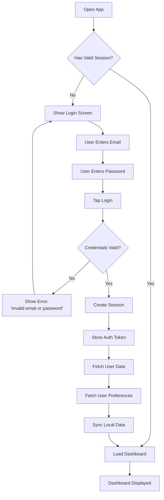

**Error Handling:**
- Invalid credentials → Clear password field, show error message
- Network error → Show "Cannot connect. Try again."
- Server error → Show "Something went wrong. Please try again."

---

### 1.2 Signup Flow

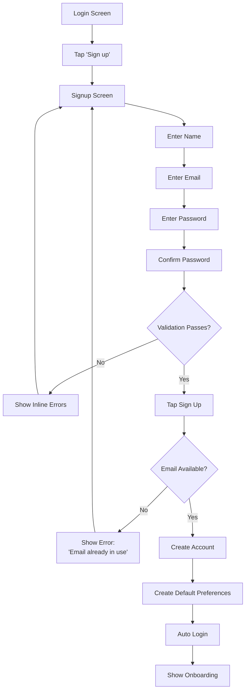

**Validation Rules:**
- Name: Required, 2-100 characters
- Email: Valid format, unique
- Password: Min 8 characters, 1 uppercase, 1 number
- Confirm: Must match password

---

## 2. First-Time User Onboarding

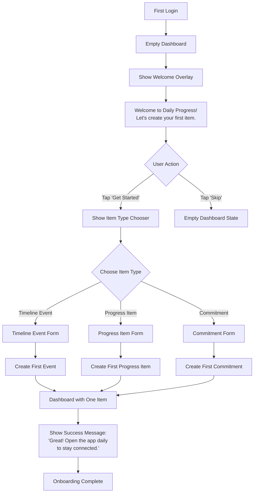

**Onboarding Content:**
- Step 1: "Daily Progress helps you remember what matters"
- Step 2: "Choose what kind of item to create"
- Step 3: "You can always add more items with the + button"

---

## 3. Daily Check-in (Weekday)

### 3.1 Morning Routine

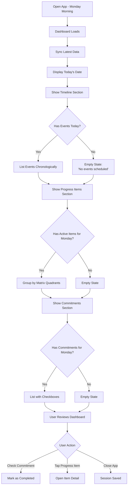

---

### 3.2 During Day - Logging Progress

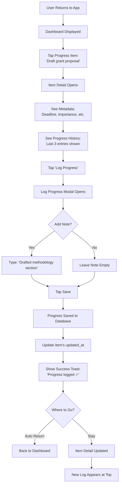

---

## 4. Daily Check-in (Weekend)

### 4.1 Saturday - Respecting Off-Days

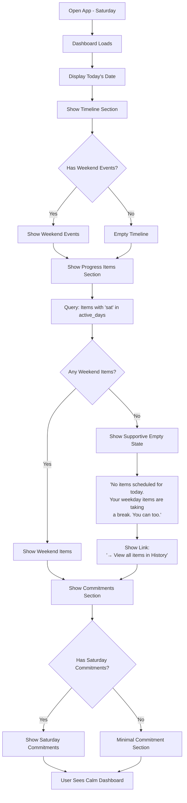

---

### 4.2 Weekend - Optional Off-Day Work

```mermaid
flowchart TD
    A[Saturday Dashboard] --> B[User Wants to Work]
    
    B --> C[Tap 'View all items in History']
    C --> D[History View Opens]
    
    D --> E[Tap 'All Items' Tab]
    E --> F[See All Active Progress Items]
    
    F --> G[Item Shows:<br/>'Active: Mon-Fri (not today)']
    
    G --> H[Tap Weekday Item]
    H --> I[Item Detail Opens Normally]
    
    I --> J[Tap 'Log Progress']
    J --> K[Log Progress Modal]
    
    K --> L[Type Note:<br/>'Weekend burst of energy!']
    L --> M[Tap Save]
    
    M --> N[Save with is_off_day=true]
    N --> O[Success Toast:<br/>'Progress logged ✓ (off-day)']
    
    O --> P[Return to History View]
    P --> Q[Item Shows New Progress]
```

**Key Behavior:**
- Off-day work is intentional (requires navigation)
- System validates the extra effort ("off-day" label)
- No guilt for not working (supportive empty state)

---

## 5. Creating Items

### 5.1 Create Progress Item

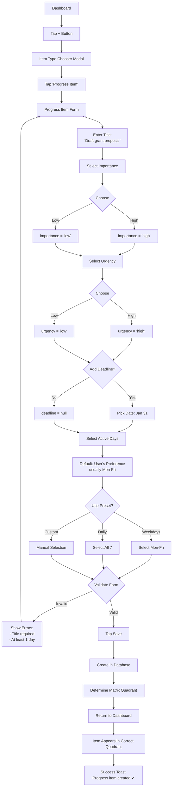

---

### 5.2 Create Commitment

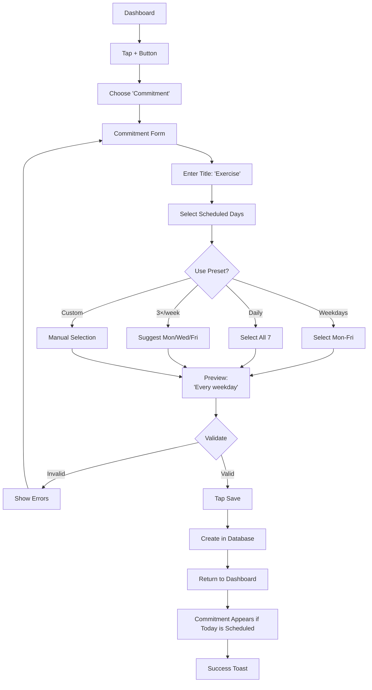

---

### 5.3 Create Timeline Event

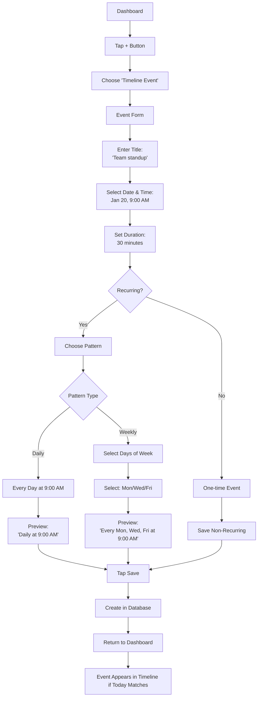

---

## 6. Logging Progress

### 6.1 Standard Progress Log

```mermaid
flowchart TD
    A[Item Detail View] --> B[Tap 'Log Progress']
    
    B --> C[Log Modal Opens]
    C --> D[See Item Title at Top]
    
    D --> E[Note Input Field Focused]
    E --> F{User Types?}
    
    F -->|Yes| G[Enter Note:<br/>max 1000 chars]
    F -->|No| H[Leave Empty]
    
    G --> I[Character Counter Updates]
    I --> J{Valid?}
    J -->|> 1000 chars| K[Disable Save, Show Warning]
    J -->|Valid| L[Enable Save]
    
    H --> L
    K --> E
    
    L --> M[Tap Save]
    M --> N[Validate: Check if on active day]
    
    N --> O{On Active Day?}
    O -->|Yes| P[is_off_day = false]
    O -->|No| Q[is_off_day = true]
    
    P --> R[Create Progress Log]
    Q --> R
    
    R --> S[Update Item's updated_at]
    S --> T[Close Modal]
    
    T --> U{is_off_day?}
    U -->|Yes| V[Toast:<br/>'Progress logged ✓ (off-day)']
    U -->|No| W[Toast:<br/>'Progress logged ✓']
    
    V --> X[Return to Item Detail]
    W --> X
    
    X --> Y[New Log Appears at Top of History]
```

---

### 6.2 Multiple Logs Same Day

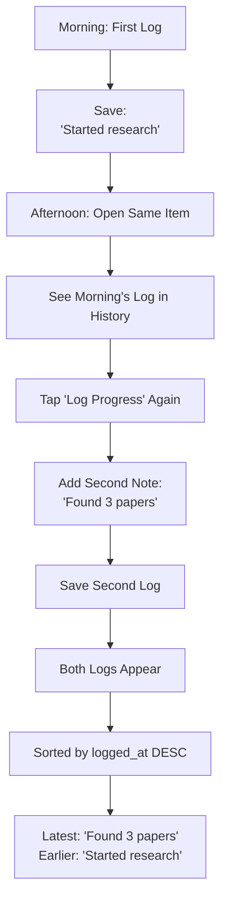

**Note:** No limit on logs per day. Each is separate entry.

---

## 7. Managing Items

### 7.1 Editing Progress Item

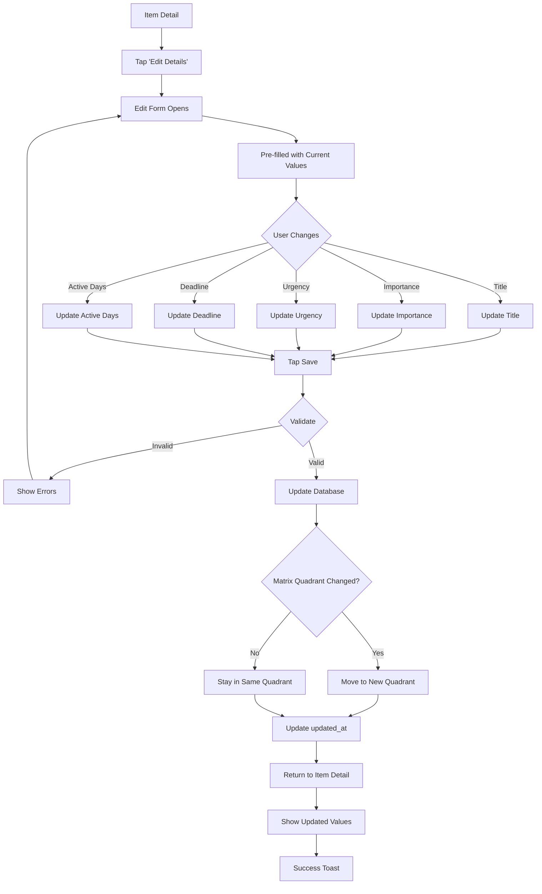

---

### 7.2 Settling Progress Item

```mermaid
flowchart TD
    A[Item Detail] --> B[Tap 'Mark as Settled']
    
    B --> C[Confirmation Dialog]
    C --> D["'Mark as Settled?<br/>This removes it from daily view.<br/>You can still see it in History.'"]
    
    D --> E{User Choice}
    E -->|Cancel| F[Close Dialog, No Change]
    E -->|Confirm| G[Update status = 'settled']
    
    G --> H[Update updated_at]
    H --> I[Remove from Active Matrix]
    
    I --> J[Return to Dashboard]
    J --> K[Item No Longer Visible]
    
    K --> L[Success Toast:<br/>'Settled. Well done.']
    
    L --> M[Item Still in History]
    M --> N[Can View in Settled Filter<br/>(Phase 2 feature)]
```

**Important:** Settled is permanent (no undo in MVP). Cannot un-settle.

---

### 7.3 Deleting Commitment

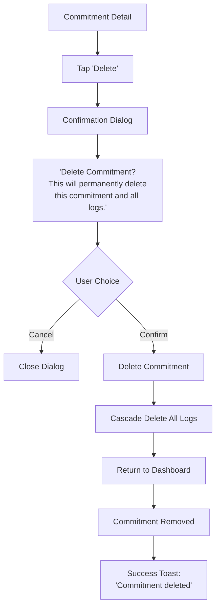

---

## 8. Viewing History

### 8.1 Today's History

```mermaid
flowchart TD
    A[Dashboard] --> B[Tap History Icon]
    
    B --> C[History View Opens]
    C --> D[Default: Today Tab]
    
    D --> E[Query Today's Logs:<br/>DATE(logged_at) = today]
    
    E --> F[Count Progress Logs]
    F --> G[Count Commitment Completions]
    
    G --> H[Display Summary:<br/>'3 progress logs and<br/>2 commitments completed']
    
    H --> I[List Progress Logs]
    I --> J[Each Log Shows:<br/>- Item title<br/>- Time<br/>- Note (if any)]
    
    J --> K[List Commitment Completions]
    K --> L[Each Shows:<br/>- Commitment title<br/>- Completion time]
    
    L --> M{User Action}
    M -->|Tap Log| N[Jump to Item Detail]
    M -->|Back| O[Return to Dashboard]
```

---

### 8.2 Weekly History

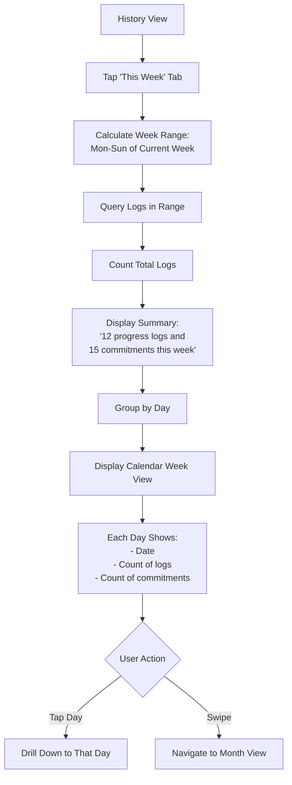

---

### 8.3 All Items View

```mermaid
flowchart TD
    A[History View] --> B[Tap 'All Items' Tab]
    
    B --> C[Query All Active Items:<br/>status = 'active']
    
    C --> D[Sort by updated_at DESC]
    
    D --> E[For Each Item, Show:<br/>- Title<br/>- Active days<br/>- Last progress]
    
    E --> F{Is Today in Active Days?}
    F -->|Yes| G[Show: 'Active: Mon-Fri']
    F -->|No| H[Show: 'Active: Mon-Fri (not today)']
    
    G --> I[List All Items]
    H --> I
    
    I --> J{User Action}
    J -->|Tap Item| K[Open Item Detail]
    J -->|Can Log Progress| L[Even if Not Active Today]
```

**Purpose:** Access all items regardless of day scheduling.

---

## 9. Settings & Preferences

### 9.1 Updating Default Active Days

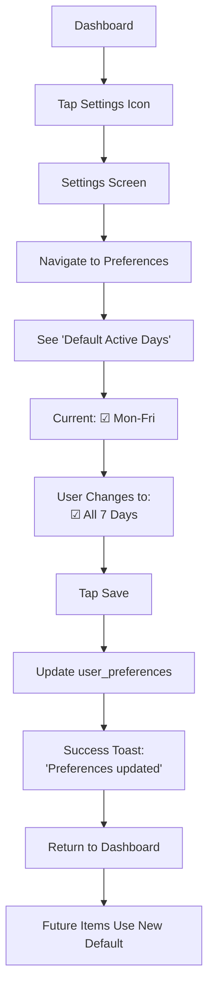

**Note:** Doesn't affect existing items, only new ones.

---

### 9.2 Changing Theme

```mermaid
flowchart TD
    A[Settings] --> B[Preferences Section]
    
    B --> C[See Theme Options:<br/>(•) Auto  ( ) Light  ( ) Dark]
    
    C --> D[Tap 'Dark']
    D --> E[Update theme = 'dark']
    
    E --> F[Apply Dark Theme Immediately]
    F --> G[Update user_preferences]
    
    G --> H[Success Toast]
    H --> I[All Screens Now Dark]
```

---

## 10. Error & Edge Cases

### 10.1 Network Offline - Creating Item

```mermaid
flowchart TD
    A[User Offline] --> B[Create Progress Item]
    
    B --> C[Fill Form]
    C --> D[Tap Save]
    
    D --> E[Detect No Network]
    E --> F[Save to IndexedDB]
    
    F --> G[Add to Sync Queue]
    G --> H[Show Item on Dashboard]
    
    H --> I[Info Banner:<br/>'Offline. Will sync when connected.']
    
    I --> J{Network Restored?}
    J -->|Yes| K[Auto Sync Queue]
    J -->|No| L[Keep in Queue]
    
    K --> M[Upload to Server]
    M --> N[Remove from Queue]
    N --> O[Hide Offline Banner]
```

---

### 10.2 Sync Conflict - Same Item Edited

```mermaid
flowchart TD
    A[Device A: Edit at 10:00 AM] --> B[Device B: Edit at 10:01 AM<br/>(offline)]
    
    B --> C[Device B Comes Online<br/>at 10:05 AM]
    
    C --> D[Sync Attempts Upload]
    D --> E[Detect Conflict:<br/>Server updated_at > Local]
    
    E --> F[Compare Timestamps]
    F --> G[Device B is Newer]
    
    G --> H[Last-Write-Wins:<br/>Device B Changes Win]
    
    H --> I[Update Server with B's Data]
    I --> J[Device A Syncs Later]
    J --> K[Receives B's Changes]
    
    K --> L[Both Devices Now in Sync]
```

**Conflict Resolution:** Simple last-write-wins acceptable for personal use.

---

### 10.3 Missing Required Fields

```mermaid
flowchart TD
    A[Create Progress Item Form] --> B[User Skips Title]
    
    B --> C[Taps Save]
    C --> D[Validate Form]
    
    D --> E{Title Empty?}
    E -->|Yes| F[Show Error:<br/>'Title is required']
    E -->|No| G{Active Days Empty?}
    
    G -->|Yes| H[Show Error:<br/>'Select at least one day']
    G -->|No| I[Proceed with Save]
    
    F --> J[Highlight Title Field Red]
    H --> K[Highlight Days Selector Red]
    
    J --> L[Keep Form Open]
    K --> L
    
    L --> M[User Corrects]
    M --> C
```

---

### 10.4 Deadline in the Past

```mermaid
flowchart TD
    A[Edit Progress Item] --> B[Change Deadline to Yesterday]
    
    B --> C[Tap Save]
    C --> D{Deadline < Today?}
    
    D -->|Yes| E[Show Warning:<br/>'Deadline is in the past.<br/>Continue anyway?']
    D -->|No| F[Save Normally]
    
    E --> G{User Choice}
    G -->|Cancel| H[Return to Form]
    G -->|Continue| I[Save with Past Deadline]
    
    I --> J[Item Shows Deadline:<br/>'Jan 15 (past)']
```

**Design Choice:** Allow past deadlines (user knows best), just warn.

---

### 10.5 No Items on Dashboard (Weekend)

```mermaid
flowchart TD
    A[Saturday Dashboard] --> B[All Sections Empty or Minimal]
    
    B --> C{User Confused?}
    C -->|Maybe| D[Empty State Explains:<br/>'No items scheduled for today']
    
    D --> E[Provide Context:<br/>'Your weekday items are resting']
    
    E --> F[Offer Action:<br/>'View all items in History']
    
    F --> G{User Taps Link?}
    G -->|Yes| H[Navigate to History]
    G -->|No| I[User Accepts Rest Day]
    
    H --> J[See All Items Available]
    J --> K[Can Choose to Work or Not]
```

---

### 10.6 Accidental Settling

```mermaid
flowchart TD
    A[User Taps 'Settle'] --> B[Confirmation Dialog]
    
    B --> C{User Reads?}
    C -->|Yes| D[Understands Consequence]
    C -->|No| E[Taps Confirm Quickly]
    
    D --> F{Correct Choice?}
    F -->|Yes| G[Item Settled]
    F -->|No| H[Taps Cancel]
    
    E --> I[Item Settled Accidentally]
    I --> J[User Notices Later]
    
    J --> K[Cannot Un-Settle in MVP]
    K --> L[Workaround:<br/>Create New Item with Same Title]
    
    L --> M[Copy Progress Notes Manually<br/>(if needed)]
```

**Phase 2 Enhancement:** Add "Undo Settle" within 24 hours.

---

### 10.7 Commitment Already Completed

```mermaid
flowchart TD
    A[Dashboard Shows:<br/>☐ Exercise] --> B[User Taps Checkbox]
    
    B --> C[Check if Already Completed Today]
    C --> D{Log Exists for Today?}
    
    D -->|No| E[Create Completion Log]
    D -->|Yes| F[Already Completed]
    
    E --> G[Update Checkbox:<br/>☐ → ☑]
    
    F --> H[Show Info:<br/>'Already completed today']
    H --> I[Checkbox Stays Checked]
    
    G --> J[Success Toast]
    J --> K[Visual Feedback:<br/>Item Grayed/Moved to Bottom]
```

---

### 10.8 Very Long Item Title

```mermaid
flowchart TD
    A[User Types 600 Character Title] --> B{Length > 500?}
    
    B -->|Yes| C[Truncate at 500]
    B -->|No| D[Accept Title]
    
    C --> E[Show Warning:<br/>'Title too long (max 500)']
    E --> F[Prevent Typing Beyond Limit]
    
    F --> G[User Must Shorten]
    G --> H[Resubmit Form]
    
    D --> I[Save Successfully]
```

---

### 10.9 Item with No Progress for 30 Days

```mermaid
flowchart TD
    A[Item: Last progress 30 days ago] --> B[Still Shows on Dashboard]
    
    B --> C{User Opens Item Detail}
    C --> D[See: 'Last: 30 days ago']
    
    D --> E{User Reflection}
    E -->|Still Relevant| F[Log New Progress]
    E -->|No Longer Relevant| G[Mark as Settled]
    E -->|Unsure| H[Leave Active]
    
    F --> I[Item Continues]
    G --> J[Item Removed from Dashboard]
    H --> K[Item Stays, User Decides Later]
```

**No Automatic Actions:** System never auto-settles or nags.

---

### 10.10 Server Down During Sync

```mermaid
flowchart TD
    A[Sync Triggered] --> B[Attempt Server Connection]
    
    B --> C{Server Reachable?}
    C -->|No| D[Retry After 30 Seconds]
    
    D --> E{Max Retries (3)?}
    E -->|No| B
    E -->|Yes| F[Give Up for Now]
    
    F --> G[Show Warning:<br/>'Cannot sync. Will try again later.']
    
    G --> H[Schedule Background Retry<br/>in 5 Minutes]
    
    C -->|Yes| I[Proceed with Sync]
```

---

## Flow Completion Checklist

| Flow | Status | Notes |
|------|--------|-------|
| Authentication | ✅ Complete | Login, Signup |
| Onboarding | ✅ Complete | First-time user |
| Daily Check-in | ✅ Complete | Weekday & Weekend |
| Creating Items | ✅ Complete | All 3 types |
| Logging Progress | ✅ Complete | On-day & Off-day |
| Managing Items | ✅ Complete | Edit, Settle, Delete |
| Viewing History | ✅ Complete | Today, Week, Month, All |
| Settings | ✅ Complete | Preferences, Theme |
| Error Handling | ✅ Complete | 10 edge cases |

---

## Summary

This document covers all major user journeys through the Daily Progress application, including:

- **Happy paths**: Standard flows that most users will follow most of the time
- **Edge cases**: Unusual but valid scenarios (off-day work, past deadlines)
- **Error handling**: What happens when things go wrong (offline, conflicts, validation)
- **Decision trees**: Every choice point and its consequences

### Key Design Principles Reflected in Flows

1. **Minimal Friction**: Most actions are 2-3 taps
2. **No Dead Ends**: Every state has a clear next action
3. **Supportive Errors**: Messages guide rather than scold
4. **Intentional Off-Day Work**: Requires navigation, not nagging
5. **Progressive Disclosure**: Show complexity only when needed
6. **Consistent Patterns**: Similar flows for similar actions

### Flow Characteristics

**Average Flow Length:**
- Quick actions (log progress, check commitment): 3-4 steps
- Medium actions (create item): 6-8 steps
- Complex actions (sync conflict resolution): 10-12 steps

**Decision Points:**
- Average 2-3 decision points per flow
- Clear default options for most choices
- Escape hatches (Cancel, Back) always available

**Error Recovery:**
- Inline validation prevents most errors
- Confirmations for destructive actions
- Offline queue prevents data loss

---

## Document Version

- **Version:** 1.0.0
- **Last Updated:** January 18, 2026
- **Status:** Complete for MVP Development