# Daily Progress - Wireframes

Visual structure and layout specifications for all screens.

---

## Screen Hierarchy


---

## 1. Login/Signup Screen

```mermaid
graph TD
    subgraph Login["Login Screen"]
        L1["═══════════════════════"]
        L2["                       "]
        L3["   Daily Progress      "]
        L4["   Progress is         "]
        L5["   acknowledged,       "]
        L6["   not judged.         "]
        L7["                       "]
        L8["═══════════════════════"]
        L9["                       "]
        L10["┌─────────────────────┐"]
        L11["│ Email               │"]
        L12["└─────────────────────┘"]
        L13["                       "]
        L14["┌─────────────────────┐"]
        L15["│ Password            │"]
        L16["└─────────────────────┘"]
        L17["                       "]
        L18["[    Login    ]        "]
        L19["                       "]
        L20["Don't have account?    "]
        L21["Sign up                "]
    end
```

**Layout:**
- Centered vertically and horizontally
- Logo/tagline at top
- Email and password inputs
- Primary action button (Login)
- Secondary link (Sign up)

**Colors:**
- Background: Soft white/light gray
- Primary button: Calm blue
- Text: Dark gray (not pure black)

---

## 2. Daily Dashboard (Weekday - Monday)

```mermaid
graph TD
    subgraph Dashboard["📱 Daily Dashboard"]
        H1["╔═══════════════════════════════╗"]
        H2["║  Daily Progress         👤    ║"]
        H3["║  Monday, January 20, 2026     ║"]
        H4["╚═══════════════════════════════╝"]
        
        T0["                               "]
        T1["📅 Timeline        [collapse ∧]"]
        T2["─────────────────────────────  "]
        T3["9:00 AM                        "]
        T4["Team standup (30m)             "]
        T5["                               "]
        T6["2:00 PM                        "]
        T7["School pickup (15m)            "]
        T8["                               "]
        
        M0["                               "]
        M1["🎯 Progress Items  [collapse ∧]"]
        M2["─────────────────────────────  "]
        M3["━━ Important & Urgent ━━       "]
        M4["                               "]
        M5["□ Draft grant proposal         "]
        M6["  Last: Jan 17 'Found refs'    "]
        M7["  Deadline: Jan 31             "]
        M8["                               "]
        M9["□ Fix production bug           "]
        M10["  Last: No progress yet        "]
        M11["  Deadline: Jan 20             "]
        M12["                               "]
        M13["━━ Important & Not Urgent ━━   "]
        M14["                               "]
        M15["□ Plan Q2 strategy             "]
        M16["  Last: Jan 15 'Outlined'      "]
        M17["  Deadline: Feb 15             "]
        M18["                               "]
        
        C0["                               "]
        C1["✓ Commitments      [collapse ∧]"]
        C2["─────────────────────────────  "]
        C3["☐ Take medication              "]
        C4["☐ Exercise (Mon/Wed/Fri)       "]
        C5["☐ Cook dinner                  "]
        C6["                               "]
        
        F1["╔═══════════════════════════════╗"]
        F2["║  🏠    📊    [+]    ⚙️         ║"]
        F3["║ Today History      Settings   ║"]
        F4["╚═══════════════════════════════╝"]
    end
```

**Interaction:**
- Tap section header to collapse/expand
- Tap item to open detail view
- Tap checkbox for commitments to mark complete
- Tap [+] to create new item

---

## 3. Daily Dashboard (Weekend - Saturday)

```mermaid
graph TD
    subgraph DashboardWeekend["📱 Daily Dashboard - Saturday"]
        H1["╔═══════════════════════════════╗"]
        H2["║  Daily Progress         👤    ║"]
        H3["║  Saturday, January 18, 2026   ║"]
        H4["╚═══════════════════════════════╝"]
        
        T0["                               "]
        T1["📅 Timeline        [collapse ∧]"]
        T2["─────────────────────────────  "]
        T3["7:00 PM                        "]
        T4["Call with mom (45m)            "]
        T5["                               "]
        
        M0["                               "]
        M1["🎯 Progress Items  [collapse ∧]"]
        M2["─────────────────────────────  "]
        M3["                               "]
        M4["  No items scheduled for today "]
        M5["                               "]
        M6["  Your weekday items are       "]
        M7["  taking a break.              "]
        M8["                               "]
        M9["  → View all items in History  "]
        M10["                               "]
        
        C0["                               "]
        C1["✓ Commitments      [collapse ∧]"]
        C2["─────────────────────────────  "]
        C3["☐ Take medication              "]
        C4["                               "]
        C5["  No other commitments today   "]
        C6["                               "]
        
        F1["╔═══════════════════════════════╗"]
        F2["║  🏠    📊    [+]    ⚙️         ║"]
        F3["║ Today History      Settings   ║"]
        F4["╚═══════════════════════════════╝"]
    end
```

**Key differences:**
- Empty/minimal Progress Items section
- Supportive message (not guilt-inducing)
- Link to History for optional work
- Fewer commitments shown

---

## 4. Item Detail View (Progress Item)

```mermaid
graph TD
    subgraph Detail["Progress Item Detail"]
        H1["╔═══════════════════════════════╗"]
        H2["║ ← Back                        ║"]
        H3["╚═══════════════════════════════╝"]
        
        T1["                               "]
        T2["Draft grant proposal           "]
        T3["                               "]
        
        M1["━━━━━━━━━━━━━━━━━━━━━━━━━━━━━━ "]
        M2["                               "]
        M3["Importance: High               "]
        M4["Urgency: Medium                "]
        M5["Deadline: January 31, 2026     "]
        M6["Active: Mon-Fri                "]
        M7["Status: Active                 "]
        M8["                               "]
        
        P1["━━━━━━━━━━━━━━━━━━━━━━━━━━━━━━ "]
        P2["Progress History               "]
        P3["━━━━━━━━━━━━━━━━━━━━━━━━━━━━━━ "]
        P4["                               "]
        P5["Jan 17, 2026 - 2:30 PM         "]
        P6["'Found 3 reference papers on   "]
        P7["similar grants'                "]
        P8["                               "]
        P9["Jan 15, 2026 - 10:00 AM        "]
        P10["'Outlined introduction section'"]
        P11["                               "]
        P12["Jan 12, 2026 - 4:15 PM         "]
        P13["'Reviewed grant requirements'  "]
        P14["                               "]
        
        A1["━━━━━━━━━━━━━━━━━━━━━━━━━━━━━━ "]
        A2["                               "]
        A3["      [  Log Progress  ]       "]
        A4["                               "]
        A5["      [  Edit Details  ]       "]
        A6["                               "]
        A7["      [ Mark as Settled ]      "]
        A8["                               "]
    end
```

**Interaction:**
- Scroll to see full history
- Tap "Log Progress" → Opens log form
- Tap "Edit Details" → Opens edit form
- Tap "Mark as Settled" → Confirmation dialog

---

## 5. Log Progress Modal

```mermaid
graph TD
    subgraph LogModal["Log Progress"]
        M1["╔═══════════════════════════════╗"]
        M2["║ Log Progress            ✕     ║"]
        M3["╚═══════════════════════════════╝"]
        
        T1["                               "]
        T2["Draft grant proposal           "]
        T3["                               "]
        
        N1["━━━━━━━━━━━━━━━━━━━━━━━━━━━━━━ "]
        N2["                               "]
        N3["What moved forward? (optional) "]
        N4["                               "]
        N5["┌─────────────────────────────┐"]
        N6["│                             │"]
        N7["│                             │"]
        N8["│                             │"]
        N9["│                             │"]
        N10["└─────────────────────────────┘"]
        N11["                               "]
        N12["0 / 1000 characters            "]
        N13["                               "]
        
        A1["━━━━━━━━━━━━━━━━━━━━━━━━━━━━━━ "]
        A2["                               "]
        A3["  [  Cancel  ]  [    Save    ] "]
        A4["                               "]
    end
```

**Behavior:**
- Note is optional (can save empty)
- Character counter shows remaining
- Save button always enabled
- Cancel closes without saving

---

## 6. Create Progress Item Form

```mermaid
graph TD
    subgraph CreateForm["New Progress Item"]
        H1["╔═══════════════════════════════╗"]
        H2["║ ← Back                        ║"]
        H3["║ New Progress Item             ║"]
        H4["╚═══════════════════════════════╝"]
        
        T1["                               "]
        T2["Title *                        "]
        T3["┌─────────────────────────────┐"]
        T4["│                             │"]
        T5["└─────────────────────────────┘"]
        T6["                               "]
        
        I1["Importance *                   "]
        I2["( ) High    ( ) Low            "]
        I3["                               "]
        
        U1["Urgency *                      "]
        U2["( ) High    ( ) Low            "]
        U3["                               "]
        
        D1["Deadline (optional)            "]
        D2["┌─────────────────────────────┐"]
        D3["│ Pick date...                │"]
        D4["└─────────────────────────────┘"]
        D5["                               "]
        
        A1["Active Days *                  "]
        A2["                               "]
        A3["[Weekdays] [Daily] [Weekends]  "]
        A4["                               "]
        A5["☑ Mon ☑ Tue ☑ Wed ☑ Thu ☑ Fri  "]
        A6["☐ Sat ☐ Sun                    "]
        A7["                               "]
        A8["This item will appear on       "]
        A9["selected days only.            "]
        A10["                               "]
        
        S1["━━━━━━━━━━━━━━━━━━━━━━━━━━━━━━ "]
        S2["                               "]
        S3["         [    Save    ]        "]
        S4["                               "]
    end
```

**Validation:**
- Title required
- Importance required
- Urgency required
- At least one active day required
- Save button disabled until valid

---

## 7. Create Commitment Form

```mermaid
graph TD
    subgraph CommitmentForm["New Commitment"]
        H1["╔═══════════════════════════════╗"]
        H2["║ ← Back                        ║"]
        H3["║ New Commitment                ║"]
        H4["╚═══════════════════════════════╝"]
        
        T1["                               "]
        T2["Title *                        "]
        T3["┌─────────────────────────────┐"]
        T4["│ e.g., Exercise, Meditation  │"]
        T5["└─────────────────────────────┘"]
        T6["                               "]
        
        S1["Scheduled Days *               "]
        S2["                               "]
        S3["[Weekdays] [Daily] [3×/week]   "]
        S4["                               "]
        S5["☑ Mon ☐ Tue ☑ Wed ☐ Thu ☑ Fri  "]
        S6["☐ Sat ☐ Sun                    "]
        S7["                               "]
        S8["This commitment will appear on "]
        S9["selected days only.            "]
        S10["                               "]
        
        V1["━━━━━━━━━━━━━━━━━━━━━━━━━━━━━━ "]
        V2["                               "]
        V3["         [    Save    ]        "]
        V4["                               "]
    end
```

**Presets:**
- Weekdays: Mon-Fri
- Daily: All 7 days
- 3×/week: Mon/Wed/Fri (suggestion)

---

## 8. Create Timeline Event Form

```mermaid
graph TD
    subgraph EventForm["New Timeline Event"]
        H1["╔═══════════════════════════════╗"]
        H2["║ ← Back                        ║"]
        H3["║ New Timeline Event            ║"]
        H4["╚═══════════════════════════════╝"]
        
        T1["                               "]
        T2["Title *                        "]
        T3["┌─────────────────────────────┐"]
        T4["│ e.g., Team standup          │"]
        T5["└─────────────────────────────┘"]
        T6["                               "]
        
        D1["Date & Time *                  "]
        D2["┌─────────────────────────────┐"]
        D3["│ Jan 20, 2026 at 9:00 AM     │"]
        D4["└─────────────────────────────┘"]
        D5["                               "]
        
        U1["Duration                       "]
        U2["┌─────────────────────────────┐"]
        U3["│ 30 minutes                  │"]
        U4["└─────────────────────────────┘"]
        U5["                               "]
        
        R1["Recurring?                     "]
        R2["( ) One-time event             "]
        R3["( ) Daily                      "]
        R4["(•) Weekly                     "]
        R5["                               "]
        
        W1["Repeat on: (for weekly)        "]
        W2["☑ Mon ☐ Tue ☑ Wed ☐ Thu ☑ Fri  "]
        W3["☐ Sat ☐ Sun                    "]
        W4["                               "]
        
        P1["Preview:                       "]
        P2["Every Mon, Wed, Fri at 9:00 AM "]
        P3["                               "]
        
        S1["━━━━━━━━━━━━━━━━━━━━━━━━━━━━━━ "]
        S2["                               "]
        S3["         [    Save    ]        "]
        S4["                               "]
    end
```

**Dynamic behavior:**
- Recurrence selection shows/hides day selector
- Preview updates based on selections

---

## 9. History View - Today Tab

```mermaid
graph TD
    subgraph HistoryToday["History - Today"]
        H1["╔═══════════════════════════════╗"]
        H2["║ ← Dashboard                   ║"]
        H3["║ History                       ║"]
        H4["╚═══════════════════════════════╝"]
        
        T1["━━━━━━━━━━━━━━━━━━━━━━━━━━━━━━ "]
        T2["[Today][This Week][This Month] "]
        T3["                  [All Items]   "]
        T4["━━━━━━━━━━━━━━━━━━━━━━━━━━━━━━ "]
        
        S1["                               "]
        S2["Monday, January 20, 2026       "]
        S3["                               "]
        S4["3 progress logs and            "]
        S5["2 commitments completed        "]
        S6["                               "]
        
        P1["━━ Progress Logs ━━            "]
        P2["                               "]
        P3["Grant proposal - 2:30 PM       "]
        P4["'Drafted methodology section'  "]
        P5["                               "]
        P6["Production bug - 11:00 AM      "]
        P7["'Identified root cause'        "]
        P8["                               "]
        P9["Blog post - 9:15 AM            "]
        P10["'Researched topic ideas'       "]
        P11["                               "]
        
        C1["━━ Commitments ━━              "]
        C2["                               "]
        C3["✓ Medication - 8:00 AM         "]
        C4["✓ Exercise - 6:30 AM           "]
        C5["                               "]
    end
```

**Interaction:**
- Tap progress log → Jump to Item Detail
- Tap commitment → Jump to Commitment Detail
- Swipe tabs to switch views

---

## 10. History View - All Items Tab

```mermaid
graph TD
    subgraph HistoryAll["History - All Items"]
        H1["╔═══════════════════════════════╗"]
        H2["║ ← Dashboard                   ║"]
        H3["║ History                       ║"]
        H4["╚═══════════════════════════════╝"]
        
        T1["━━━━━━━━━━━━━━━━━━━━━━━━━━━━━━ "]
        T2["[Today][This Week][This Month] "]
        T3["                  [All Items]   "]
        T4["━━━━━━━━━━━━━━━━━━━━━━━━━━━━━━ "]
        
        I1["                               "]
        I2["All Active Progress Items      "]
        I3["                               "]
        
        L1["□ Draft grant proposal         "]
        L2["  Active: Mon-Fri              "]
        L3["  Last: Jan 17 'Found refs'    "]
        L4["                               "]
        
        L5["□ Fix production bug           "]
        L6["  Active: Mon-Fri              "]
        L7["  Last: No progress yet        "]
        L8["                               "]
        
        L9["□ Plan Q2 strategy             "]
        L10["  Active: Mon-Fri              "]
        L11["  Last: Jan 15 'Outlined'      "]
        L12["                               "]
        
        L13["□ Learn Spanish                "]
        L14["  Active: Sat-Sun (not today)  "]
        L15["  Last: Jan 12 'Lesson 3'      "]
        L16["                               "]
    end
```

**Purpose:**
- See all items regardless of active days
- Access items on off-days
- Log progress on any item anytime

---

## 11. Settings Screen

```mermaid
graph TD
    subgraph Settings["Settings"]
        H1["╔═══════════════════════════════╗"]
        H2["║ ← Dashboard                   ║"]
        H3["║ Settings                      ║"]
        H4["╚═══════════════════════════════╝"]
        
        A1["━━ Account ━━                  "]
        A2["                               "]
        A3["Name: Test User                "]
        A4["Email: test@example.com        "]
        A5["                               "]
        A6["[ Change Password ]            "]
        A7["                               "]
        
        P1["━━ Preferences ━━              "]
        P2["                               "]
        P3["Default Active Days            "]
        P4["☑ Mon ☑ Tue ☑ Wed ☑ Thu ☑ Fri  "]
        P5["☐ Sat ☐ Sun                    "]
        P6["                               "]
        P7["Theme                          "]
        P8["(•) Auto  ( ) Light  ( ) Dark  "]
        P9["                               "]
        P10["Timezone                       "]
        P11["Asia/Jakarta                   "]
        P12["                               "]
        
        N1["━━ Notifications ━━            "]
        N2["                               "]
        N3["☑ Daily reminder (9:00 AM)     "]
        N4["                               "]
        
        D1["━━ Data ━━                     "]
        D2["                               "]
        D3["[ Export Data ]                "]
        D4["[ Delete Account ]             "]
        D5["                               "]
    end
```

---

## 12. Confirmation Dialogs

### Settle Item Confirmation

```mermaid
graph TD
    subgraph Settle["Confirm Settle"]
        C1["╔═══════════════════════════════╗"]
        C2["║ Mark as Settled?              ║"]
        C3["╚═══════════════════════════════╝"]
        C4["                               "]
        C5["This will remove this item from"]
        C6["your daily view. You can still "]
        C7["see it in History.             "]
        C8["                               "]
        C9["This action cannot be undone.  "]
        C10["                               "]
        C11["  [  Cancel  ]  [  Settle  ]   "]
    end
```

### Delete Commitment Confirmation

```mermaid
graph TD
    subgraph Delete["Confirm Delete"]
        D1["╔═══════════════════════════════╗"]
        D2["║ Delete Commitment?            ║"]
        D3["╚═══════════════════════════════╝"]
        D4["                               "]
        D5["This will permanently delete   "]
        D6["this commitment and all its    "]
        D7["completion history.            "]
        D8["                               "]
        D9["This action cannot be undone.  "]
        D10["                               "]
        D11["  [  Cancel  ]  [  Delete  ]   "]
    end
```

---

## 13. Empty States

### Empty Dashboard (First Time User)

```mermaid
graph TD
    subgraph Empty["Empty Dashboard"]
        E1["                               "]
        E2["       📋                      "]
        E3["                               "]
        E4["   Welcome to Daily Progress   "]
        E5["                               "]
        E6["   Let's create your first     "]
        E7["   item to get started.        "]
        E8["                               "]
        E9["   [ + Create First Item ]     "]
        E10["                               "]
    end
```

### Empty Timeline

```mermaid
graph TD
    subgraph EmptyTimeline["Empty Timeline"]
        T1["📅 Timeline                    "]
        T2["─────────────────────────────  "]
        T3["                               "]
        T4["  No events scheduled today    "]
        T5["                               "]
        T6["  + Add event                  "]
        T7["                               "]
    end
```

### Empty Matrix (Weekend)

```mermaid
graph TD
    subgraph EmptyMatrix["Empty Progress Items"]
        M1["🎯 Progress Items              "]
        M2["─────────────────────────────  "]
        M3["                               "]
        M4["  No items scheduled for today "]
        M5["                               "]
        M6["  Taking a break? That's okay. "]
        M7["                               "]
        M8["  → View all items in History  "]
        M9["                               "]
    end
```

---

## 14. Loading States

### Dashboard Loading

```mermaid
graph TD
    subgraph Loading["Loading Dashboard"]
        L1["                               "]
        L2["       ⟳                       "]
        L3["                               "]
        L4["   Loading your progress...    "]
        L5["                               "]
    end
```

### Syncing Indicator

```mermaid
graph TD
    subgraph Sync["Syncing"]
        S1["╔═══════════════════════════════╗"]
        S2["║  Daily Progress    ⟳ Syncing  ║"]
        S3["║  Monday, January 20, 2026     ║"]
        S4["╚═══════════════════════════════╝"]
    end
```

---

## 15. Success Messages

### Progress Logged

```mermaid
graph TD
    subgraph Success["Success Toast"]
        T1["╔═══════════════════════════════╗"]
        T2["║  ✓ Progress logged            ║"]
        T3["╚═══════════════════════════════╝"]
    end
```

### Item Settled

```mermaid
graph TD
    subgraph Settled["Settled Toast"]
        T1["╔═══════════════════════════════╗"]
        T2["║  ✓ Settled. Well done.        ║"]
        T3["╚═══════════════════════════════╝"]
    end
```

### Commitment Completed

```mermaid
graph TD
    subgraph Completed["Completed Toast"]
        T1["╔═══════════════════════════════╗"]
        T2["║  ✓ Commitment completed       ║"]
        T3["╚═══════════════════════════════╝"]
    end
```

---

## Design Specifications

### Typography
- **Header (H1)**: 24px, Semi-Bold
- **Section Title (H2)**: 18px, Semi-Bold
- **Item Title**: 16px, Medium
- **Body Text**: 14px, Regular
- **Secondary Text**: 12px, Regular
- **Font Family**: System default (San Francisco on iOS, Roboto on Android)

### Colors

#### Light Theme
- **Background**: #FFFFFF
- **Surface**: #F5F5F5
- **Primary**: #4A90E2 (Calm blue)
- **Text Primary**: #2C3E50
- **Text Secondary**: #7F8C8D
- **Border**: #E0E0E0
- **Success**: #27AE60
- **Warning**: #F39C12
- **Destructive**: #E74C3C (used sparingly)

#### Dark Theme
- **Background**: #1A1A1A
- **Surface**: #2C2C2C
- **Primary**: #5DA3F5
- **Text Primary**: #ECEFF1
- **Text Secondary**: #B0BEC5
- **Border**: #424242
- **Success**: #4CAF50
- **Warning**: #FFA726
- **Destructive**: #EF5350

### Spacing
- **Extra Small (XS)**: 4px
- **Small (S)**: 8px
- **Medium (M)**: 16px
- **Large (L)**: 24px
- **Extra Large (XL)**: 32px

### Border Radius
- **Small**: 4px (input fields)
- **Medium**: 8px (cards, buttons)
- **Large**: 12px (modals)

### Shadows
- **Card**: 0 2px 4px rgba(0,0,0,0.1)
- **Modal**: 0 8px 16px rgba(0,0,0,0.15)
- **Button Hover**: 0 4px 8px rgba(0,0,0,0.12)

### Animations
- **Duration**: 200-300ms
- **Easing**: ease-in-out
- **Interactions**: Subtle scale (1.02) on button press
- **Transitions**: Smooth page transitions

---

## Responsive Breakpoints

### Mobile (Default)
- Width: 320px - 767px
- Single column layout
- Full-width cards
- Bottom navigation

### Tablet
- Width: 768px - 1023px
- Two-column layout for forms
- Sidebar navigation option

### Desktop (Future)
- Width: 1024px+
- Multi-column dashboard
- Persistent sidebar