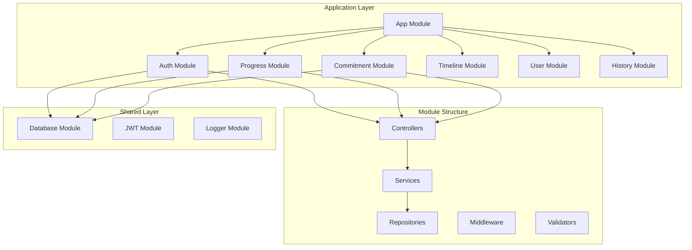
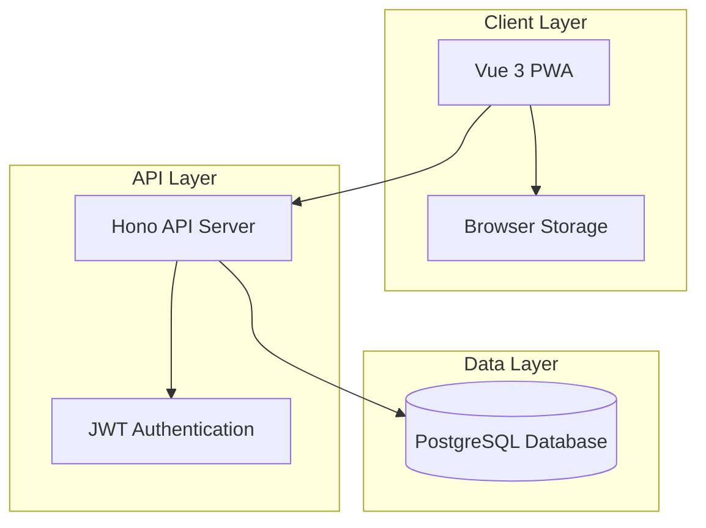
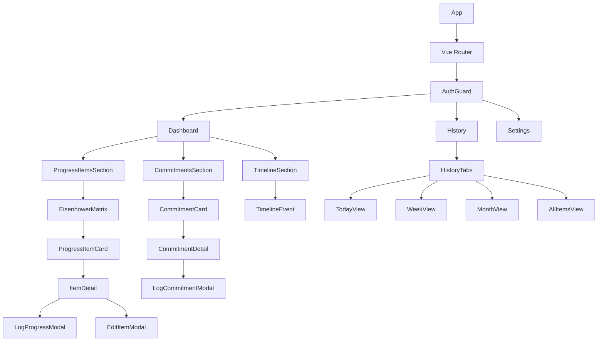

# Design Document

## Overview

Daily Progress Phase 1 is a Progressive Web Application (PWA) that implements a daily-first productivity system. The application consists of a Vue.js frontend with TypeScript, a Bun/Hono backend API, and a PostgreSQL database. The system focuses on core functionality with a clean, responsive interface and reliable data persistence.

The core architecture follows a modular pattern similar to NestJS with clear separation between modules, controllers, services, and repositories. The design emphasizes dependency injection, single responsibility principle, and testability while supporting the "progress is acknowledged, not judged" philosophy.

### Core Development Principles

#### Keep It Simple, Stupid (KISS)
- Choose the most straightforward solution that addresses the requirements
- Favor readability over cleverness
- Minimize complexity by using built-in features before custom implementations
- Ask: "Could a new developer understand this code without extensive explanation?"

#### You Aren't Gonna Need It (YAGNI)
- Don't implement functionality until it's actually needed
- Avoid speculative features based on what "might be needed later"
- Focus on the current requirements
- If a feature isn't explicitly requested, don't build it

#### Don't Repeat Yourself (DRY), But Not Obsessively
- Extract common logic into utility functions or services where it makes sense
- But don't over-abstract - sometimes duplication is clearer than the wrong abstraction
- Only extract code when you've seen the pattern repeated at least 2-3 times
- Balance DRY with readability and maintainability

#### Modularity & Single Responsibility
- Each module should have one clear purpose and responsibility
- Clear boundaries between modules
- Functions should do one thing and do it well
- Keep file size manageable (generally under 500 lines)

### Modular Architecture



## Architecture

### System Architecture Diagram



### Technology Stack

**Frontend:**
- Vue 3 with Composition API and TypeScript
- Vite for build tooling and development server
- Vue Router for navigation
- Pinia for state management
- VueUse for composable utilities
- Tailwind CSS for styling
- PWA capabilities with Vite PWA plugin

**Backend:**
- Bun runtime with Hono framework
- Modular architecture with dependency injection
- TypeScript (native support in Bun)
- Prisma ORM for database operations
- JWT for authentication
- bcrypt for password hashing
- PostgreSQL database
- Winston for logging
- Zod for validation

**Database:**
- PostgreSQL 14+ for primary data storage
- Prisma as ORM with type-safe database access
- Database migrations with Prisma Migrate

**Infrastructure:**
- Bun for runtime and package management
- Docker containers for development and deployment
- Environment-based configuration
- HTTPS/TLS encryption
- CORS configuration for PWA

## Components and Interfaces

### Backend Modular Architecture

#### Project Structure
```
src/
├── modules/
│   ├── auth/
│   │   ├── auth.controller.ts
│   │   ├── auth.service.ts
│   │   ├── auth.middleware.ts
│   │   ├── auth.validator.ts
│   │   └── auth.module.ts
│   ├── progress/
│   │   ├── progress.controller.ts
│   │   ├── progress.service.ts
│   │   ├── progress.repository.ts
│   │   ├── progress.validator.ts
│   │   └── progress.module.ts
│   ├── commitment/
│   │   ├── commitment.controller.ts
│   │   ├── commitment.service.ts
│   │   ├── commitment.repository.ts
│   │   ├── commitment.validator.ts
│   │   └── commitment.module.ts
│   ├── timeline/
│   │   ├── timeline.controller.ts
│   │   ├── timeline.service.ts
│   │   ├── timeline.repository.ts
│   │   ├── timeline.validator.ts
│   │   └── timeline.module.ts
│   ├── user/
│   │   ├── user.controller.ts
│   │   ├── user.service.ts
│   │   ├── user.repository.ts
│   │   ├── user.validator.ts
│   │   └── user.module.ts
│   └── history/
│       ├── history.controller.ts
│       ├── history.service.ts
│       ├── history.validator.ts
│       └── history.module.ts
├── shared/
│   ├── database/
│   │   ├── database.service.ts
│   │   └── database.module.ts
│   ├── jwt/
│   │   ├── jwt.service.ts
│   │   └── jwt.module.ts
│   ├── logger/
│   │   ├── logger.service.ts
│   │   └── logger.module.ts
│   ├── response/
│   │   ├── response.helper.ts
│   │   └── response.types.ts
│   └── validation/
│       ├── validation.middleware.ts
│       └── validation.schemas.ts
├── types/
│   ├── auth.types.ts
│   ├── progress.types.ts
│   ├── commitment.types.ts
│   └── common.types.ts
├── app.ts
└── main.ts
```

#### Module System Implementation

```typescript
// shared/module/module.system.ts
export interface ModuleMetadata {
  controllers?: any[];
  services?: any[];
  repositories?: any[];
  imports?: any[];
  exports?: any[];
}

export class ModuleContainer {
  private static instance: ModuleContainer;
  private modules = new Map<string, any>();
  private services = new Map<string, any>();

  static getInstance(): ModuleContainer {
    if (!ModuleContainer.instance) {
      ModuleContainer.instance = new ModuleContainer();
    }
    return ModuleContainer.instance;
  }

  registerModule(name: string, metadata: ModuleMetadata) {
    this.modules.set(name, metadata);
    
    // Register services for dependency injection
    metadata.services?.forEach(ServiceClass => {
      const serviceName = ServiceClass.name;
      this.services.set(serviceName, new ServiceClass());
    });
  }

  getService<T>(serviceName: string): T {
    return this.services.get(serviceName);
  }
}

// Decorator for modules
export function Module(metadata: ModuleMetadata) {
  return function (target: any) {
    const container = ModuleContainer.getInstance();
    container.registerModule(target.name, metadata);
  };
}

// Decorator for injectable services
export function Injectable() {
  return function (target: any) {
    // Mark class as injectable
    Reflect.defineMetadata('injectable', true, target);
  };
}
```

#### Auth Module Example

```typescript
// modules/auth/auth.controller.ts
import { Hono } from 'hono';
import { AuthService } from './auth.service';
import { loginValidator, registerValidator } from './auth.validator';
import { createSuccessResponse, createErrorResponse } from '../../shared/response/response.helper';

export class AuthController {
  private authService: AuthService;

  constructor() {
    this.authService = ModuleContainer.getInstance().getService<AuthService>('AuthService');
  }

  setupRoutes(): Hono {
    const router = new Hono();

    router.post('/login', loginValidator, async (c) => {
      try {
        const { email, password } = await c.req.json();
        const result = await this.authService.login(email, password);
        
        return c.json(createSuccessResponse(
          'S001',
          'Login successful',
          result
        ));
      } catch (error) {
        if (error instanceof InvalidCredentialsError) {
          return c.json(createErrorResponse(
            'E001',
            'Invalid email or password'
          ), 401);
        }
        throw error;
      }
    });

    router.post('/register', registerValidator, async (c) => {
      try {
        const userData = await c.req.json();
        const result = await this.authService.register(userData);
        
        return c.json(createSuccessResponse(
          'S002',
          'Registration successful',
          result
        ), 201);
      } catch (error) {
        if (error instanceof EmailExistsError) {
          return c.json(createErrorResponse(
            'E002',
            'Email already exists'
          ), 400);
        }
        throw error;
      }
    });

    return router;
  }
}

// modules/auth/auth.service.ts
@Injectable()
export class AuthService {
  private userRepository: UserRepository;
  private jwtService: JwtService;

  constructor() {
    this.userRepository = ModuleContainer.getInstance().getService<UserRepository>('UserRepository');
    this.jwtService = ModuleContainer.getInstance().getService<JwtService>('JwtService');
  }

  async login(email: string, password: string) {
    const user = await this.userRepository.findByEmail(email);
    if (!user || !await bcrypt.compare(password, user.passwordHash)) {
      throw new InvalidCredentialsError();
    }

    const token = await this.jwtService.generateToken(user.id);
    const preferences = await this.userRepository.getPreferences(user.id);

    return {
      token,
      user: this.sanitizeUser(user),
      preferences
    };
  }

  async register(userData: RegisterRequest) {
    const existingUser = await this.userRepository.findByEmail(userData.email);
    if (existingUser) {
      throw new EmailExistsError();
    }

    const hashedPassword = await bcrypt.hash(userData.password, 12);
    const user = await this.userRepository.create({
      ...userData,
      passwordHash: hashedPassword
    });

    const preferences = await this.userRepository.createDefaultPreferences(user.id);

    return {
      user: this.sanitizeUser(user),
      preferences
    };
  }

  private sanitizeUser(user: User) {
    const { passwordHash, ...sanitized } = user;
    return sanitized;
  }
}

// modules/auth/auth.validator.ts
import { z } from 'zod';
import { validationMiddleware } from '../../shared/validation/validation.middleware';

const loginSchema = z.object({
  email: z.string().email('Invalid email format'),
  password: z.string().min(1, 'Password is required')
});

const registerSchema = z.object({
  name: z.string().min(2, 'Name must be at least 2 characters'),
  email: z.string().email('Invalid email format'),
  password: z.string()
    .min(8, 'Password must be at least 8 characters')
    .regex(/[A-Z]/, 'Password must contain at least one uppercase letter')
    .regex(/[0-9]/, 'Password must contain at least one number')
});

export const loginValidator = validationMiddleware(loginSchema);
export const registerValidator = validationMiddleware(registerSchema);

// modules/auth/auth.module.ts
import { AuthController } from './auth.controller';
import { AuthService } from './auth.service';

@Module({
  controllers: [AuthController],
  services: [AuthService],
  imports: ['UserModule', 'JwtModule'],
  exports: [AuthService]
})
export class AuthModule {}
```

#### Progress Module Example

```typescript
// modules/progress/progress.controller.ts
export class ProgressController {
  private progressService: ProgressService;

  constructor() {
    this.progressService = ModuleContainer.getInstance().getService<ProgressService>('ProgressService');
  }

  setupRoutes(): Hono {
    const router = new Hono();

    // Apply JWT middleware to all routes
    router.use('/*', jwtMiddleware);

    router.get('/', async (c) => {
      try {
        const userId = c.get('jwtPayload').sub;
        const page = parseInt(c.req.query('page') || '1');
        const limit = parseInt(c.req.query('limit') || '10');
        
        const result = await this.progressService.getPaginated(userId, page, limit);
        
        return c.json(createPaginatedResponse(
          'S003',
          'Progress items retrieved successfully',
          result.items,
          result.pagination
        ));
      } catch (error) {
        return c.json(createErrorResponse(
          'E005',
          'Failed to retrieve progress items'
        ), 500);
      }
    });

    router.post('/', createProgressItemValidator, async (c) => {
      try {
        const userId = c.get('jwtPayload').sub;
        const data = await c.req.json();
        
        const item = await this.progressService.create(userId, data);
        
        return c.json(createSuccessResponse(
          'S004',
          'Progress item created successfully',
          item
        ), 201);
      } catch (error) {
        if (error instanceof ValidationError) {
          return c.json(createErrorResponse(
            'E002',
            'Validation failed',
            error.details,
            error.field
          ), 400);
        }
        throw error;
      }
    });

    router.post('/:id/logs', createProgressLogValidator, async (c) => {
      try {
        const userId = c.get('jwtPayload').sub;
        const itemId = c.req.param('id');
        const data = await c.req.json();
        
        const log = await this.progressService.logProgress(userId, itemId, data);
        
        return c.json(createSuccessResponse(
          'S007',
          'Progress logged successfully',
          log
        ), 201);
      } catch (error) {
        if (error instanceof NotFoundError) {
          return c.json(createErrorResponse(
            'E003',
            'Progress item not found'
          ), 404);
        }
        throw error;
      }
    });

    return router;
  }
}

// modules/progress/progress.service.ts
@Injectable()
export class ProgressService {
  private progressRepository: ProgressRepository;

  constructor() {
    this.progressRepository = ModuleContainer.getInstance().getService<ProgressRepository>('ProgressRepository');
  }

  async getPaginated(userId: string, page: number, limit: number) {
    const offset = (page - 1) * limit;
    const [items, total] = await Promise.all([
      this.progressRepository.findByUserId(userId, limit, offset),
      this.progressRepository.countByUserId(userId)
    ]);

    return {
      items,
      pagination: {
        total,
        perPage: limit,
        currentPage: page,
        lastPage: Math.ceil(total / limit)
      }
    };
  }

  async create(userId: string, data: CreateProgressItemRequest) {
    return this.progressRepository.create({
      ...data,
      userId,
      status: 'active'
    });
  }

  async logProgress(userId: string, itemId: string, data: CreateProgressLogRequest) {
    // Verify item belongs to user
    const item = await this.progressRepository.findById(itemId);
    if (!item || item.userId !== userId) {
      throw new NotFoundError('Progress item not found');
    }

    // Check if logging on off-day
    const today = new Date().toLocaleDateString('en-US', { weekday: 'short' }).toLowerCase();
    const isOffDay = !item.activeDays.includes(today);

    return this.progressRepository.createLog({
      progressItemId: itemId,
      note: data.note,
      loggedAt: new Date(data.loggedAt),
      isOffDay
    });
  }
}

// modules/progress/progress.repository.ts
@Injectable()
export class ProgressRepository {
  private prisma: PrismaClient;

  constructor() {
    this.prisma = ModuleContainer.getInstance().getService<DatabaseService>('DatabaseService').prisma;
  }

  async findByUserId(userId: string, limit: number, offset: number) {
    return this.prisma.progressItem.findMany({
      where: { userId, status: 'active' },
      include: {
        logs: {
          orderBy: { loggedAt: 'desc' },
          take: 3
        }
      },
      orderBy: { updatedAt: 'desc' },
      take: limit,
      skip: offset
    });
  }

  async countByUserId(userId: string) {
    return this.prisma.progressItem.count({
      where: { userId, status: 'active' }
    });
  }

  async create(data: any) {
    return this.prisma.progressItem.create({ data });
  }

  async createLog(data: any) {
    return this.prisma.progressLog.create({ data });
  }

  async findById(id: string) {
    return this.prisma.progressItem.findUnique({ where: { id } });
  }
}

// modules/progress/progress.module.ts
@Module({
  controllers: [ProgressController],
  services: [ProgressService],
  repositories: [ProgressRepository],
  imports: ['DatabaseModule'],
  exports: [ProgressService]
})
export class ProgressModule {}
```

#### Application Bootstrap

```typescript
// app.ts
import { Hono } from 'hono';
import { cors } from 'hono/cors';
import { logger } from 'hono/logger';
import { AuthModule } from './modules/auth/auth.module';
import { ProgressModule } from './modules/progress/progress.module';
import { CommitmentModule } from './modules/commitment/commitment.module';
import { errorHandler } from './shared/middleware/error.middleware';

export class Application {
  private app: Hono;
  private container: ModuleContainer;

  constructor() {
    this.app = new Hono();
    this.container = ModuleContainer.getInstance();
    this.setupMiddleware();
    this.setupModules();
    this.setupErrorHandling();
  }

  private setupMiddleware() {
    this.app.use('*', cors());
    this.app.use('*', logger());
  }

  private setupModules() {
    // Initialize modules
    new AuthModule();
    new ProgressModule();
    new CommitmentModule();

    // Setup routes
    const authController = new AuthController();
    const progressController = new ProgressController();
    const commitmentController = new CommitmentController();

    this.app.route('/api/auth', authController.setupRoutes());
    this.app.route('/api/progress-items', progressController.setupRoutes());
    this.app.route('/api/commitments', commitmentController.setupRoutes());
  }

  private setupErrorHandling() {
    this.app.onError(errorHandler);
  }

  getApp(): Hono {
    return this.app;
  }
}

// main.ts
import { Application } from './app';

const app = new Application();
const server = app.getApp();

export default {
  port: process.env.PORT || 3000,
  fetch: server.fetch,
};
```

### Frontend Component Architecture



### Core Components

#### 1. Dashboard Component
```typescript
// Dashboard.vue
<script setup lang="ts">
interface Props {
  date: Date;
}

interface DashboardState {
  timelineEvents: TimelineEvent[];
  progressItems: ProgressItem[];
  commitments: Commitment[];
  loading: boolean;
  error: string | null;
}

const props = defineProps<Props>();
const { timelineEvents, progressItems, commitments, loading, error } = useDashboard(props.date);
</script>
```

#### 2. Progress Item Card Component
```typescript
// ProgressItemCard.vue
<script setup lang="ts">
interface Props {
  item: ProgressItem;
}

interface Emits {
  (e: 'log-progress', itemId: string): void;
  (e: 'edit', itemId: string): void;
  (e: 'settle', itemId: string): void;
}

const props = defineProps<Props>();
const emit = defineEmits<Emits>();
</script>
```

#### 3. Eisenhower Matrix Component
```typescript
// EisenhowerMatrix.vue
<script setup lang="ts">
interface Props {
  items: ProgressItem[];
}

interface Emits {
  (e: 'item-action', action: ItemAction, itemId: string): void;
}

type ItemAction = 'log' | 'edit' | 'settle' | 'view';

const props = defineProps<Props>();
const emit = defineEmits<Emits>();

const quadrants = computed(() => {
  return {
    importantUrgent: props.items.filter(item => 
      item.importance === 'high' && item.urgency === 'high'
    ),
    importantNotUrgent: props.items.filter(item => 
      item.importance === 'high' && item.urgency === 'low'
    ),
    notImportantUrgent: props.items.filter(item => 
      item.importance === 'low' && item.urgency === 'high'
    ),
    notImportantNotUrgent: props.items.filter(item => 
      item.importance === 'low' && item.urgency === 'low'
    )
  };
});
</script>
```

#### 4. Log Progress Modal Component
```typescript
// LogProgressModal.vue
<script setup lang="ts">
interface Props {
  item: ProgressItem | Commitment;
  isOpen: boolean;
}

interface Emits {
  (e: 'close'): void;
  (e: 'save', note: string): void;
}

const props = defineProps<Props>();
const emit = defineEmits<Emits>();

const note = ref('');
const isLoading = ref(false);

const handleSave = async () => {
  isLoading.value = true;
  try {
    emit('save', note.value);
    note.value = '';
    emit('close');
  } finally {
    isLoading.value = false;
  }
};
</script>
```

### Composables for Business Logic

#### 1. Dashboard Composable
```typescript
// composables/useDashboard.ts
export function useDashboard(date: Ref<Date>) {
  const timelineEvents = ref<TimelineEvent[]>([]);
  const progressItems = ref<ProgressItem[]>([]);
  const commitments = ref<Commitment[]>([]);
  const loading = ref(false);
  const error = ref<string | null>(null);

  const loadDashboardData = async () => {
    loading.value = true;
    error.value = null;
    
    try {
      const [events, items, commitmentsList] = await Promise.all([
        api.getTimelineEvents(date.value),
        api.getProgressItems(date.value),
        api.getCommitments(date.value)
      ]);
      
      timelineEvents.value = events;
      progressItems.value = items;
      commitments.value = commitmentsList;
    } catch (err) {
      error.value = handleApiError(err);
    } finally {
      loading.value = false;
    }
  };

  watchEffect(() => {
    loadDashboardData();
  });

  return {
    timelineEvents: readonly(timelineEvents),
    progressItems: readonly(progressItems),
    commitments: readonly(commitments),
    loading: readonly(loading),
    error: readonly(error),
    refresh: loadDashboardData
  };
}
```

#### 2. Progress Item Composable
```typescript
// composables/useProgressItems.ts
export function useProgressItems() {
  const items = ref<ProgressItem[]>([]);
  const loading = ref(false);

  const createItem = async (data: CreateProgressItemRequest) => {
    const newItem = await api.createProgressItem(data);
    items.value.push(newItem);
    return newItem;
  };

  const logProgress = async (itemId: string, note?: string) => {
    const log = await api.createProgressLog(itemId, { note });
    // Update local state or trigger refresh
    return log;
  };

  const settleItem = async (itemId: string) => {
    await api.settleProgressItem(itemId);
    const index = items.value.findIndex(item => item.id === itemId);
    if (index !== -1) {
      items.value[index].status = 'settled';
    }
  };

  return {
    items: readonly(items),
    loading: readonly(loading),
    createItem,
    logProgress,
    settleItem
  };
}
```

### API Interface Design

#### Response Templates

All API responses follow a standardized format:

```typescript
// Base response interface
interface ApiResponse<T = any> {
  data: T;
  message: string;
  code: string;
}

// Success response - data contains the actual response data
interface SuccessResponse<T> extends ApiResponse<T> {
  code: string; // Always starts with 'S'
}

// Error response - data contains error details
interface ErrorResponse extends ApiResponse<{
  details?: any;
  field?: string;
}> {
  code: string; // Always starts with 'E'
}

// Paginated response - data contains both items and pagination info
interface PaginatedResponse<T> extends ApiResponse<{
  data: T[];
  pagination: {
    total: number;
    perPage: number;
    currentPage: number;
    lastPage: number;
  };
}> {
  code: string; // Always starts with 'S'
}

// Response helper functions
const createSuccessResponse = <T>(
  code: string,
  message: string,
  data: T
): SuccessResponse<T> => ({
  data,
  message,
  code
});

const createErrorResponse = (
  code: string,
  message: string,
  details?: any,
  field?: string
): ErrorResponse => ({
  data: { details, field },
  message,
  code
});

const createPaginatedResponse = <T>(
  code: string,
  message: string,
  items: T[],
  pagination: {
    total: number;
    perPage: number;
    currentPage: number;
    lastPage: number;
  }
): PaginatedResponse<T> => ({
  data: { data: items, pagination },
  message,
  code
});
```

#### Response Codes

**Success Codes (S-prefix):**
- `S001`: Login successful
- `S002`: Registration successful
- `S003`: Data retrieved successfully
- `S004`: Item created successfully
- `S005`: Item updated successfully
- `S006`: Item deleted successfully
- `S007`: Progress logged successfully

**Error Codes (E-prefix):**
- `E001`: Invalid credentials
- `E002`: Validation failed
- `E003`: Item not found
- `E004`: Unauthorized access
- `E005`: Server error
- `E006`: Database error
- `E007`: Rate limit exceeded

#### Authentication Endpoints
```typescript
// POST /api/auth/login
interface LoginRequest {
  email: string;
  password: string;
}

type LoginResponse = SuccessResponse<{
  token: string;
  user: User;
  preferences: UserPreferences;
}>;

// Example success response:
// {
//   "data": {
//     "token": "jwt-token-here",
//     "user": { ... },
//     "preferences": { ... }
//   },
//   "message": "Login successful",
//   "code": "S001"
// }

// Example error response:
// {
//   "data": {
//     "details": null,
//     "field": "email"
//   },
//   "message": "Invalid email or password",
//   "code": "E001"
// }

// POST /api/auth/register
interface RegisterRequest {
  name: string;
  email: string;
  password: string;
}

type RegisterResponse = SuccessResponse<{
  user: User;
  preferences: UserPreferences;
}>;
```

#### Progress Items Endpoints
```typescript
// GET /api/progress-items?page=1&limit=10
type GetProgressItemsResponse = PaginatedResponse<ProgressItem>;

// Example paginated response:
// {
//   "data": {
//     "data": [{ ... }, { ... }],
//     "pagination": {
//       "total": 25,
//       "perPage": 10,
//       "currentPage": 1,
//       "lastPage": 3
//     }
//   },
//   "message": "Progress items retrieved successfully",
//   "code": "S003"
// }

// POST /api/progress-items
interface CreateProgressItemRequest {
  title: string;
  importance: 'high' | 'low';
  urgency: 'high' | 'low';
  deadline?: string;
  activeDays: DayOfWeek[];
}

type CreateProgressItemResponse = SuccessResponse<ProgressItem>;

// POST /api/progress-items/:id/logs
interface CreateProgressLogRequest {
  note?: string;
  loggedAt: string;
}

type CreateProgressLogResponse = SuccessResponse<ProgressLog>;
```

#### Commitments Endpoints
```typescript
// GET /api/commitments
type GetCommitmentsResponse = SuccessResponse<Commitment[]>;

// POST /api/commitments
interface CreateCommitmentRequest {
  title: string;
  scheduledDays: DayOfWeek[];
}

type CreateCommitmentResponse = SuccessResponse<Commitment>;

// POST /api/commitments/:id/logs
interface CreateCommitmentLogRequest {
  note?: string;
  completedAt: string;
}

type CreateCommitmentLogResponse = SuccessResponse<CommitmentLog>;
```

#### Hono Route Implementation Examples

```typescript
// routes/auth.ts
import { Hono } from 'hono';
import { jwt } from 'hono/jwt';

const auth = new Hono();

auth.post('/login', async (c) => {
  try {
    const { email, password } = await c.req.json<LoginRequest>();
    
    const user = await authService.validateCredentials(email, password);
    const token = await authService.generateToken(user.id);
    const preferences = await userService.getPreferences(user.id);
    
    return c.json(createSuccessResponse(
      'S001',
      'Login successful',
      { token, user, preferences }
    ));
  } catch (error) {
    if (error instanceof InvalidCredentialsError) {
      return c.json(createErrorResponse(
        'E001',
        'Invalid email or password'
      ), 401);
    }
    
    return c.json(createErrorResponse(
      'E005',
      'Internal server error'
    ), 500);
  }
});

// routes/progress-items.ts
const progressItems = new Hono();

progressItems.use('/*', jwt({ secret: process.env.JWT_SECRET! }));

progressItems.get('/', async (c) => {
  try {
    const userId = c.get('jwtPayload').sub;
    const page = parseInt(c.req.query('page') || '1');
    const limit = parseInt(c.req.query('limit') || '10');
    
    const result = await progressItemService.getPaginated(userId, page, limit);
    
    return c.json(createPaginatedResponse(
      'S003',
      'Progress items retrieved successfully',
      result.items,
      result.pagination
    ));
  } catch (error) {
    return c.json(createErrorResponse(
      'E005',
      'Failed to retrieve progress items'
    ), 500);
  }
});

progressItems.post('/', async (c) => {
  try {
    const userId = c.get('jwtPayload').sub;
    const data = await c.req.json<CreateProgressItemRequest>();
    
    const item = await progressItemService.create(userId, data);
    
    return c.json(createSuccessResponse(
      'S004',
      'Progress item created successfully',
      item
    ), 201);
  } catch (error) {
    if (error instanceof ValidationError) {
      return c.json(createErrorResponse(
        'E002',
        'Validation failed',
        error.details,
        error.field
      ), 400);
    }
    
    return c.json(createErrorResponse(
      'E005',
      'Failed to create progress item'
    ), 500);
  }
});
```

## Data Models

### Core Entity Models

#### User Model
```typescript
interface User {
  id: string;
  email: string;
  name: string;
  createdAt: string;
  updatedAt: string;
  lastLogin?: string;
}

interface UserPreferences {
  id: string;
  userId: string;
  defaultActiveDays: DayOfWeek[];
  theme: 'light' | 'dark' | 'auto';
  timezone: string;
  enableNotifications: boolean;
  createdAt: string;
  updatedAt: string;
}
```

#### Progress Item Model
```typescript
interface ProgressItem {
  id: string;
  userId: string;
  title: string;
  importance: 'high' | 'low';
  urgency: 'high' | 'low';
  deadline?: string;
  activeDays: DayOfWeek[];
  status: 'active' | 'settled';
  createdAt: string;
  updatedAt: string;
}

interface ProgressLog {
  id: string;
  progressItemId: string;
  loggedAt: string;
  note?: string;
  isOffDay: boolean;
  createdAt: string;
}
```

#### Commitment Model
```typescript
interface Commitment {
  id: string;
  userId: string;
  title: string;
  scheduledDays: DayOfWeek[];
  createdAt: string;
  updatedAt: string;
}

interface CommitmentLog {
  id: string;
  commitmentId: string;
  completedAt: string;
  note?: string;
  createdAt: string;
}
```

#### Timeline Event Model
```typescript
interface TimelineEvent {
  id: string;
  userId: string;
  title: string;
  startTime: string;
  durationMinutes: number;
  recurrencePattern?: 'daily' | 'weekly' | 'custom';
  daysOfWeek?: DayOfWeek[];
  status: 'active' | 'settled';
  createdAt: string;
  updatedAt: string;
}
```

#### Utility Types
```typescript
type DayOfWeek = 'mon' | 'tue' | 'wed' | 'thu' | 'fri' | 'sat' | 'sun';

interface EisenhowerQuadrant {
  name: string;
  importance: 'high' | 'low';
  urgency: 'high' | 'low';
  items: ProgressItem[];
}
```

### Database Schema Implementation

The database follows the schema defined in `docs/SCHEMA.md` implemented using Prisma ORM:

#### Prisma Schema
```prisma
// schema.prisma
generator client {
  provider = "prisma-client-js"
}

datasource db {
  provider = "postgresql"
  url      = env("DATABASE_URL")
}

model User {
  id          String   @id @default(cuid())
  email       String   @unique
  passwordHash String  @map("password_hash")
  name        String
  createdAt   DateTime @default(now()) @map("created_at")
  updatedAt   DateTime @updatedAt @map("updated_at")
  lastLogin   DateTime? @map("last_login")

  preferences    UserPreferences?
  progressItems  ProgressItem[]
  commitments    Commitment[]
  timelineEvents TimelineEvent[]

  @@map("users")
}

model UserPreferences {
  id                  String   @id @default(cuid())
  userId              String   @unique @map("user_id")
  defaultActiveDays   Json     @default("[\"mon\",\"tue\",\"wed\",\"thu\",\"fri\"]") @map("default_active_days")
  theme               String   @default("auto")
  timezone            String   @default("UTC")
  enableNotifications Boolean  @default(true) @map("enable_notifications")
  createdAt           DateTime @default(now()) @map("created_at")
  updatedAt           DateTime @updatedAt @map("updated_at")

  user User @relation(fields: [userId], references: [id], onDelete: Cascade)

  @@map("user_preferences")
}

model ProgressItem {
  id          String   @id @default(cuid())
  userId      String   @map("user_id")
  title       String
  importance  String   // 'high' | 'low'
  urgency     String   // 'high' | 'low'
  deadline    DateTime?
  activeDays  Json     @map("active_days")
  status      String   @default("active") // 'active' | 'settled'
  createdAt   DateTime @default(now()) @map("created_at")
  updatedAt   DateTime @updatedAt @map("updated_at")

  user User @relation(fields: [userId], references: [id], onDelete: Cascade)
  logs ProgressLog[]

  @@map("progress_items")
}

model ProgressLog {
  id             String   @id @default(cuid())
  progressItemId String   @map("progress_item_id")
  loggedAt       DateTime @map("logged_at")
  note           String?
  isOffDay       Boolean  @default(false) @map("is_off_day")
  createdAt      DateTime @default(now()) @map("created_at")

  progressItem ProgressItem @relation(fields: [progressItemId], references: [id], onDelete: Cascade)

  @@map("progress_logs")
}

model Commitment {
  id            String   @id @default(cuid())
  userId        String   @map("user_id")
  title         String
  scheduledDays Json     @map("scheduled_days")
  createdAt     DateTime @default(now()) @map("created_at")
  updatedAt     DateTime @updatedAt @map("updated_at")

  user User @relation(fields: [userId], references: [id], onDelete: Cascade)
  logs CommitmentLog[]

  @@map("commitments")
}

model CommitmentLog {
  id           String   @id @default(cuid())
  commitmentId String   @map("commitment_id")
  completedAt  DateTime @map("completed_at")
  note         String?
  createdAt    DateTime @default(now()) @map("created_at")

  commitment Commitment @relation(fields: [commitmentId], references: [id], onDelete: Cascade)

  @@map("commitment_logs")
}

model TimelineEvent {
  id                String    @id @default(cuid())
  userId            String    @map("user_id")
  title             String
  startTime         DateTime  @map("start_time")
  durationMinutes   Int       @default(30) @map("duration_minutes")
  recurrencePattern String?   @map("recurrence_pattern") // 'daily' | 'weekly' | 'custom'
  daysOfWeek        Json?     @map("days_of_week")
  status            String    @default("active") // 'active' | 'settled'
  createdAt         DateTime  @default(now()) @map("created_at")
  updatedAt         DateTime  @updatedAt @map("updated_at")

  user User @relation(fields: [userId], references: [id], onDelete: Cascade)

  @@map("timeline_events")
}
```

#### Database Service with Prisma
```typescript
// services/DatabaseService.ts
import { PrismaClient } from '@prisma/client';

export class DatabaseService {
  private prisma: PrismaClient;

  constructor() {
    this.prisma = new PrismaClient({
      log: ['query', 'info', 'warn', 'error'],
    });
  }

  async getProgressItemsForDay(userId: string, dayOfWeek: string) {
    return this.prisma.progressItem.findMany({
      where: {
        userId,
        status: 'active',
        activeDays: {
          array_contains: [dayOfWeek]
        }
      },
      include: {
        logs: {
          orderBy: { loggedAt: 'desc' },
          take: 3
        }
      }
    });
  }

  async createProgressLog(progressItemId: string, data: { note?: string; loggedAt: Date; isOffDay: boolean }) {
    return this.prisma.progressLog.create({
      data: {
        progressItemId,
        ...data
      }
    });
  }

  async getCommitmentsForDay(userId: string, dayOfWeek: string) {
    return this.prisma.commitment.findMany({
      where: {
        userId,
        scheduledDays: {
          array_contains: [dayOfWeek]
        }
      },
      include: {
        logs: {
          where: {
            completedAt: {
              gte: new Date(new Date().setHours(0, 0, 0, 0))
            }
          }
        }
      }
    });
  }
}
```

## Error Handling

### Frontend Error Handling Strategy

#### 1. Network Error Handling
```typescript
class ApiError extends Error {
  constructor(
    public status: number,
    public message: string,
    public code?: string
  ) {
    super(message);
  }
}

const handleApiError = (error: ApiError): string => {
  switch (error.status) {
    case 401:
      return 'Please log in again';
    case 403:
      return 'You do not have permission for this action';
    case 404:
      return 'The requested item was not found';
    case 500:
      return 'Something went wrong. Please try again.';
    default:
      return error.message || 'An unexpected error occurred';
  }
};
```

#### 2. Form Validation
```typescript
interface ValidationRule<T> {
  validate: (value: T) => boolean;
  message: string;
}

interface FormValidation {
  title: ValidationRule<string>[];
  email: ValidationRule<string>[];
  activeDays: ValidationRule<DayOfWeek[]>[];
}

const progressItemValidation: FormValidation = {
  title: [
    {
      validate: (value) => value.trim().length > 0,
      message: 'Title is required'
    },
    {
      validate: (value) => value.length <= 500,
      message: 'Title must be 500 characters or less'
    }
  ],
  activeDays: [
    {
      validate: (value) => value.length > 0,
      message: 'Select at least one active day'
    }
  ]
};
```

### Backend Error Handling

#### 1. Global Error Handler
```typescript
interface ApiErrorResponse {
  error: {
    message: string;
    code?: string;
    details?: any;
  };
  timestamp: string;
  path: string;
}

const errorHandler = (
  err: Error,
  req: Request,
  res: Response,
  next: NextFunction
) => {
  const response: ApiErrorResponse = {
    error: {
      message: err.message || 'Internal server error',
      code: (err as any).code
    },
    timestamp: new Date().toISOString(),
    path: req.path
  };

  if (err instanceof ValidationError) {
    res.status(400).json(response);
  } else if (err instanceof AuthenticationError) {
    res.status(401).json(response);
  } else if (err instanceof AuthorizationError) {
    res.status(403).json(response);
  } else if (err instanceof NotFoundError) {
    res.status(404).json(response);
  } else {
    logger.error('Unhandled error:', err);
    res.status(500).json(response);
  }
};
```

#### 2. Database Error Handling
```typescript
class DatabaseService {
  private prisma = new PrismaClient();

  async executeWithErrorHandling<T>(operation: () => Promise<T>): Promise<T> {
    try {
      return await operation();
    } catch (error) {
      if (error.code === 'P2002') { // Unique constraint violation
        throw new ValidationError('This item already exists');
      } else if (error.code === 'P2003') { // Foreign key constraint violation
        throw new ValidationError('Referenced item not found');
      } else if (error.code === 'P2025') { // Record not found
        throw new NotFoundError('Item not found');
      } else {
        logger.error('Database operation failed:', error);
        throw new DatabaseError('Database operation failed');
      }
    }
  }
}
```

## Testing Strategy

### Test-Driven Development (TDD) Approach

The entire application will be built using Test-Driven Development methodology:

1. **Red**: Write a failing test first
2. **Green**: Write minimal code to make the test pass
3. **Refactor**: Improve code while keeping tests green

### TDD Workflow for Backend

#### 1. Unit Tests First (Bun Test)
```typescript
// tests/modules/progress/progress.service.test.ts
import { describe, it, expect, beforeEach, mock } from 'bun:test';
import { ProgressService } from '../../../src/modules/progress/progress.service';
import { ProgressRepository } from '../../../src/modules/progress/progress.repository';

describe('ProgressService', () => {
  let progressService: ProgressService;
  let mockProgressRepository: any;

  beforeEach(() => {
    mockProgressRepository = {
      findByUserId: mock(),
      countByUserId: mock(),
      create: mock(),
      createLog: mock(),
      findById: mock()
    };
    
    // Mock the module container
    const mockContainer = {
      getService: mock((serviceName: string) => {
        if (serviceName === 'ProgressRepository') return mockProgressRepository;
        return null;
      })
    };
    
    progressService = new ProgressService();
  });

  describe('getPaginated', () => {
    it('should return paginated progress items', async () => {
      // Arrange
      const userId = 'user-123';
      const page = 1;
      const limit = 10;
      const mockItems = [
        { id: 'item-1', title: 'Test Item 1', userId },
        { id: 'item-2', title: 'Test Item 2', userId }
      ];
      const mockTotal = 25;

      mockProgressRepository.findByUserId.mockResolvedValue(mockItems);
      mockProgressRepository.countByUserId.mockResolvedValue(mockTotal);

      // Act
      const result = await progressService.getPaginated(userId, page, limit);

      // Assert
      expect(result.items).toEqual(mockItems);
      expect(result.pagination).toEqual({
        total: 25,
        perPage: 10,
        currentPage: 1,
        lastPage: 3
      });
      expect(mockProgressRepository.findByUserId).toHaveBeenCalledWith(userId, 10, 0);
      expect(mockProgressRepository.countByUserId).toHaveBeenCalledWith(userId);
    });

    it('should handle empty results', async () => {
      // Arrange
      const userId = 'user-123';
      mockProgressRepository.findByUserId.mockResolvedValue([]);
      mockProgressRepository.countByUserId.mockResolvedValue(0);

      // Act
      const result = await progressService.getPaginated(userId, 1, 10);

      // Assert
      expect(result.items).toEqual([]);
      expect(result.pagination.total).toBe(0);
      expect(result.pagination.lastPage).toBe(0);
    });
  });

  describe('create', () => {
    it('should create a new progress item', async () => {
      // Arrange
      const userId = 'user-123';
      const itemData = {
        title: 'New Progress Item',
        importance: 'high' as const,
        urgency: 'low' as const,
        activeDays: ['mon', 'tue', 'wed']
      };
      const expectedItem = { id: 'item-123', ...itemData, userId, status: 'active' };

      mockProgressRepository.create.mockResolvedValue(expectedItem);

      // Act
      const result = await progressService.create(userId, itemData);

      // Assert
      expect(result).toEqual(expectedItem);
      expect(mockProgressRepository.create).toHaveBeenCalledWith({
        ...itemData,
        userId,
        status: 'active'
      });
    });
  });

  describe('logProgress', () => {
    it('should log progress for valid item', async () => {
      // Arrange
      const userId = 'user-123';
      const itemId = 'item-123';
      const logData = {
        note: 'Made good progress',
        loggedAt: '2026-01-20T10:00:00Z'
      };
      const mockItem = {
        id: itemId,
        userId,
        activeDays: ['mon', 'tue', 'wed', 'thu', 'fri']
      };
      const expectedLog = {
        id: 'log-123',
        progressItemId: itemId,
        note: logData.note,
        loggedAt: new Date(logData.loggedAt),
        isOffDay: false
      };

      mockProgressRepository.findById.mockResolvedValue(mockItem);
      mockProgressRepository.createLog.mockResolvedValue(expectedLog);

      // Mock date to return Monday
      const mockDate = new Date('2026-01-20'); // Monday
      global.Date = class extends Date {
        constructor() {
          super();
          return mockDate;
        }
        static now() {
          return mockDate.getTime();
        }
      } as any;

      // Act
      const result = await progressService.logProgress(userId, itemId, logData);

      // Assert
      expect(result).toEqual(expectedLog);
      expect(mockProgressRepository.findById).toHaveBeenCalledWith(itemId);
      expect(mockProgressRepository.createLog).toHaveBeenCalledWith({
        progressItemId: itemId,
        note: logData.note,
        loggedAt: new Date(logData.loggedAt),
        isOffDay: false
      });
    });

    it('should mark as off-day when logging on non-active day', async () => {
      // Arrange - item active Mon-Fri, logging on Saturday
      const userId = 'user-123';
      const itemId = 'item-123';
      const logData = {
        note: 'Weekend work',
        loggedAt: '2026-01-25T10:00:00Z' // Saturday
      };
      const mockItem = {
        id: itemId,
        userId,
        activeDays: ['mon', 'tue', 'wed', 'thu', 'fri'] // No weekend
      };

      mockProgressRepository.findById.mockResolvedValue(mockItem);
      mockProgressRepository.createLog.mockResolvedValue({});

      // Mock date to return Saturday
      const mockDate = new Date('2026-01-25'); // Saturday
      global.Date = class extends Date {
        constructor() {
          super();
          return mockDate;
        }
        static now() {
          return mockDate.getTime();
        }
      } as any;

      // Act
      await progressService.logProgress(userId, itemId, logData);

      // Assert
      expect(mockProgressRepository.createLog).toHaveBeenCalledWith(
        expect.objectContaining({
          isOffDay: true
        })
      );
    });

    it('should throw NotFoundError for non-existent item', async () => {
      // Arrange
      const userId = 'user-123';
      const itemId = 'non-existent';
      const logData = { note: 'Test', loggedAt: '2026-01-20T10:00:00Z' };

      mockProgressRepository.findById.mockResolvedValue(null);

      // Act & Assert
      expect(async () => {
        await progressService.logProgress(userId, itemId, logData);
      }).toThrow('Progress item not found');
    });

    it('should throw NotFoundError for item belonging to different user', async () => {
      // Arrange
      const userId = 'user-123';
      const itemId = 'item-123';
      const logData = { note: 'Test', loggedAt: '2026-01-20T10:00:00Z' };
      const mockItem = {
        id: itemId,
        userId: 'different-user', // Different user
        activeDays: ['mon']
      };

      mockProgressRepository.findById.mockResolvedValue(mockItem);

      // Act & Assert
      expect(async () => {
        await progressService.logProgress(userId, itemId, logData);
      }).toThrow('Progress item not found');
    });
  });
});
```

#### 2. Integration Tests (API Level)
```typescript
// tests/integration/progress.integration.test.ts
import { describe, it, expect, beforeEach, afterEach } from 'bun:test';
import { Application } from '../../src/app';
import { DatabaseService } from '../../src/shared/database/database.service';

describe('Progress API Integration', () => {
  let app: Application;
  let authToken: string;
  let testUserId: string;

  beforeEach(async () => {
    // Setup test database
    await setupTestDatabase();
    
    // Create test application
    app = new Application();
    
    // Create test user and get auth token
    const testUser = await createTestUser();
    testUserId = testUser.id;
    authToken = await generateTestToken(testUserId);
  });

  afterEach(async () => {
    await cleanupTestDatabase();
  });

  describe('POST /api/progress-items', () => {
    it('should create progress item with valid data', async () => {
      // Arrange
      const itemData = {
        title: 'Integration Test Item',
        importance: 'high',
        urgency: 'low',
        activeDays: ['mon', 'tue', 'wed']
      };

      // Act
      const response = await app.getApp().request('/api/progress-items', {
        method: 'POST',
        headers: {
          'Content-Type': 'application/json',
          'Authorization': `Bearer ${authToken}`
        },
        body: JSON.stringify(itemData)
      });

      // Assert
      expect(response.status).toBe(201);
      
      const responseData = await response.json();
      expect(responseData.code).toBe('S004');
      expect(responseData.message).toBe('Progress item created successfully');
      expect(responseData.data.title).toBe(itemData.title);
      expect(responseData.data.id).toBeDefined();
    });

    it('should return validation error for invalid data', async () => {
      // Arrange
      const invalidData = {
        title: '', // Empty title
        importance: 'invalid',
        urgency: 'low'
      };

      // Act
      const response = await app.getApp().request('/api/progress-items', {
        method: 'POST',
        headers: {
          'Content-Type': 'application/json',
          'Authorization': `Bearer ${authToken}`
        },
        body: JSON.stringify(invalidData)
      });

      // Assert
      expect(response.status).toBe(400);
      
      const responseData = await response.json();
      expect(responseData.code).toBe('E002');
      expect(responseData.message).toBe('Validation failed');
    });

    it('should return 401 for missing auth token', async () => {
      // Arrange
      const itemData = {
        title: 'Test Item',
        importance: 'high',
        urgency: 'low',
        activeDays: ['mon']
      };

      // Act
      const response = await app.getApp().request('/api/progress-items', {
        method: 'POST',
        headers: {
          'Content-Type': 'application/json'
          // No Authorization header
        },
        body: JSON.stringify(itemData)
      });

      // Assert
      expect(response.status).toBe(401);
    });
  });

  describe('GET /api/progress-items', () => {
    it('should return paginated progress items', async () => {
      // Arrange - Create test items
      await createTestProgressItems(testUserId, 15);

      // Act
      const response = await app.getApp().request('/api/progress-items?page=1&limit=10', {
        method: 'GET',
        headers: {
          'Authorization': `Bearer ${authToken}`
        }
      });

      // Assert
      expect(response.status).toBe(200);
      
      const responseData = await response.json();
      expect(responseData.code).toBe('S003');
      expect(responseData.data.data).toHaveLength(10);
      expect(responseData.data.pagination.total).toBe(15);
      expect(responseData.data.pagination.currentPage).toBe(1);
      expect(responseData.data.pagination.lastPage).toBe(2);
    });
  });
});
```

### TDD Workflow for Frontend

#### 1. Component Tests First (Vitest + Vue Test Utils)
```typescript
// tests/components/ProgressItemCard.test.ts
import { describe, it, expect, vi, beforeEach } from 'vitest';
import { mount } from '@vue/test-utils';
import { createPinia, setActivePinia } from 'pinia';
import ProgressItemCard from '@/components/ProgressItemCard.vue';
import type { ProgressItem } from '@/types/progress.types';

describe('ProgressItemCard', () => {
  let mockItem: ProgressItem;

  beforeEach(() => {
    setActivePinia(createPinia());
    
    mockItem = {
      id: 'item-1',
      title: 'Test Progress Item',
      importance: 'high',
      urgency: 'low',
      activeDays: ['mon', 'tue', 'wed', 'thu', 'fri'],
      status: 'active',
      deadline: '2026-01-31',
      createdAt: '2026-01-01T00:00:00Z',
      updatedAt: '2026-01-01T00:00:00Z',
      userId: 'user-1'
    };
  });

  it('should render item title and metadata', () => {
    // Arrange & Act
    const wrapper = mount(ProgressItemCard, {
      props: { item: mockItem }
    });

    // Assert
    expect(wrapper.find('[data-testid="item-title"]').text()).toBe('Test Progress Item');
    expect(wrapper.find('[data-testid="item-quadrant"]').text()).toContain('Important & Not Urgent');
    expect(wrapper.find('[data-testid="item-deadline"]').text()).toContain('Jan 31');
  });

  it('should emit log-progress event when log button is clicked', async () => {
    // Arrange
    const wrapper = mount(ProgressItemCard, {
      props: { item: mockItem }
    });

    // Act
    await wrapper.find('[data-testid="log-progress-btn"]').trigger('click');

    // Assert
    expect(wrapper.emitted('log-progress')).toBeTruthy();
    expect(wrapper.emitted('log-progress')![0]).toEqual([mockItem.id]);
  });

  it('should emit edit event when edit button is clicked', async () => {
    // Arrange
    const wrapper = mount(ProgressItemCard, {
      props: { item: mockItem }
    });

    // Act
    await wrapper.find('[data-testid="edit-btn"]').trigger('click');

    // Assert
    expect(wrapper.emitted('edit')).toBeTruthy();
    expect(wrapper.emitted('edit')![0]).toEqual([mockItem.id]);
  });

  it('should show correct quadrant for different importance/urgency combinations', () => {
    // Test all four quadrants
    const testCases = [
      { importance: 'high', urgency: 'high', expected: 'Important & Urgent' },
      { importance: 'high', urgency: 'low', expected: 'Important & Not Urgent' },
      { importance: 'low', urgency: 'high', expected: 'Not Important & Urgent' },
      { importance: 'low', urgency: 'low', expected: 'Not Important & Not Urgent' }
    ];

    testCases.forEach(({ importance, urgency, expected }) => {
      // Arrange
      const testItem = { ...mockItem, importance, urgency } as ProgressItem;
      const wrapper = mount(ProgressItemCard, {
        props: { item: testItem }
      });

      // Assert
      expect(wrapper.find('[data-testid="item-quadrant"]').text()).toContain(expected);
    });
  });

  it('should show overdue styling for past deadlines', () => {
    // Arrange
    const overdueItem = {
      ...mockItem,
      deadline: '2025-12-31' // Past date
    };
    const wrapper = mount(ProgressItemCard, {
      props: { item: overdueItem }
    });

    // Assert
    expect(wrapper.find('[data-testid="item-deadline"]').classes()).toContain('text-red-500');
  });
});
```

#### 2. Composable Tests
```typescript
// tests/composables/useDashboard.test.ts
import { describe, it, expect, vi, beforeEach } from 'vitest';
import { ref } from 'vue';
import { useDashboard } from '@/composables/useDashboard';
import * as api from '@/services/api';

// Mock the API
vi.mock('@/services/api');

describe('useDashboard', () => {
  beforeEach(() => {
    vi.clearAllMocks();
  });

  it('should load dashboard data on mount', async () => {
    // Arrange
    const mockDate = ref(new Date('2026-01-20'));
    const mockTimelineEvents = [{ id: '1', title: 'Meeting' }];
    const mockProgressItems = [{ id: '1', title: 'Task' }];
    const mockCommitments = [{ id: '1', title: 'Exercise' }];

    vi.mocked(api.getTimelineEvents).mockResolvedValue(mockTimelineEvents);
    vi.mocked(api.getProgressItems).mockResolvedValue(mockProgressItems);
    vi.mocked(api.getCommitments).mockResolvedValue(mockCommitments);

    // Act
    const { timelineEvents, progressItems, commitments, loading, error } = useDashboard(mockDate);

    // Wait for async operations
    await new Promise(resolve => setTimeout(resolve, 0));

    // Assert
    expect(api.getTimelineEvents).toHaveBeenCalledWith(mockDate.value);
    expect(api.getProgressItems).toHaveBeenCalledWith(mockDate.value);
    expect(api.getCommitments).toHaveBeenCalledWith(mockDate.value);
    
    expect(timelineEvents.value).toEqual(mockTimelineEvents);
    expect(progressItems.value).toEqual(mockProgressItems);
    expect(commitments.value).toEqual(mockCommitments);
    expect(loading.value).toBe(false);
    expect(error.value).toBe(null);
  });

  it('should handle API errors gracefully', async () => {
    // Arrange
    const mockDate = ref(new Date('2026-01-20'));
    const mockError = new Error('API Error');

    vi.mocked(api.getTimelineEvents).mockRejectedValue(mockError);
    vi.mocked(api.getProgressItems).mockResolvedValue([]);
    vi.mocked(api.getCommitments).mockResolvedValue([]);

    // Act
    const { error, loading } = useDashboard(mockDate);

    // Wait for async operations
    await new Promise(resolve => setTimeout(resolve, 0));

    // Assert
    expect(error.value).toBe('Failed to load dashboard data');
    expect(loading.value).toBe(false);
  });

  it('should reload data when date changes', async () => {
    // Arrange
    const mockDate = ref(new Date('2026-01-20'));
    vi.mocked(api.getTimelineEvents).mockResolvedValue([]);
    vi.mocked(api.getProgressItems).mockResolvedValue([]);
    vi.mocked(api.getCommitments).mockResolvedValue([]);

    const { } = useDashboard(mockDate);

    // Wait for initial load
    await new Promise(resolve => setTimeout(resolve, 0));
    
    // Clear previous calls
    vi.clearAllMocks();

    // Act - Change date
    mockDate.value = new Date('2026-01-21');

    // Wait for reload
    await new Promise(resolve => setTimeout(resolve, 0));

    // Assert
    expect(api.getTimelineEvents).toHaveBeenCalledWith(mockDate.value);
    expect(api.getProgressItems).toHaveBeenCalledWith(mockDate.value);
    expect(api.getCommitments).toHaveBeenCalledWith(mockDate.value);
  });
});
```

#### 3. E2E Tests (Playwright)
```typescript
// tests/e2e/progress-flow.spec.ts
import { test, expect } from '@playwright/test';

test.describe('Progress Item Flow', () => {
  test.beforeEach(async ({ page }) => {
    // Login before each test
    await page.goto('/login');
    await page.fill('[data-testid="email-input"]', 'test@example.com');
    await page.fill('[data-testid="password-input"]', 'password123');
    await page.click('[data-testid="login-button"]');
    await expect(page).toHaveURL('/dashboard');
  });

  test('should create and log progress on new item', async ({ page }) => {
    // Test: Create new progress item
    await page.click('[data-testid="add-item-button"]');
    await page.click('[data-testid="progress-item-option"]');
    
    await page.fill('[data-testid="item-title-input"]', 'E2E Test Item');
    await page.click('[data-testid="importance-high"]');
    await page.click('[data-testid="urgency-low"]');
    await page.click('[data-testid="active-day-mon"]');
    await page.click('[data-testid="active-day-tue"]');
    await page.click('[data-testid="save-item-button"]');

    // Verify item appears on dashboard
    await expect(page.locator('[data-testid="item-title"]')).toContainText('E2E Test Item');
    await expect(page.locator('[data-testid="item-quadrant"]')).toContainText('Important & Not Urgent');

    // Test: Log progress
    await page.click('[data-testid="log-progress-btn"]');
    await page.fill('[data-testid="progress-note-input"]', 'Made excellent progress on this task');
    await page.click('[data-testid="save-progress-button"]');

    // Verify success message
    await expect(page.locator('[data-testid="success-toast"]')).toContainText('Progress logged successfully');

    // Verify progress appears in item detail
    await page.click('[data-testid="item-title"]');
    await expect(page.locator('[data-testid="progress-log"]')).toContainText('Made excellent progress on this task');
  });

  test('should handle validation errors gracefully', async ({ page }) => {
    // Test: Try to create item with empty title
    await page.click('[data-testid="add-item-button"]');
    await page.click('[data-testid="progress-item-option"]');
    
    // Leave title empty
    await page.click('[data-testid="importance-high"]');
    await page.click('[data-testid="urgency-low"]');
    await page.click('[data-testid="save-item-button"]');

    // Verify validation error
    await expect(page.locator('[data-testid="title-error"]')).toContainText('Title is required');
    
    // Verify form doesn't submit
    await expect(page).toHaveURL(/.*create-item.*/);
  });

  test('should work offline and sync when online', async ({ page, context }) => {
    // Go offline
    await context.setOffline(true);

    // Create item while offline
    await page.click('[data-testid="add-item-button"]');
    await page.click('[data-testid="progress-item-option"]');
    await page.fill('[data-testid="item-title-input"]', 'Offline Test Item');
    await page.click('[data-testid="importance-high"]');
    await page.click('[data-testid="urgency-high"]');
    await page.click('[data-testid="save-item-button"]');

    // Verify offline indicator
    await expect(page.locator('[data-testid="offline-indicator"]')).toBeVisible();
    
    // Verify item appears locally
    await expect(page.locator('[data-testid="item-title"]')).toContainText('Offline Test Item');

    // Go back online
    await context.setOffline(false);

    // Wait for sync
    await expect(page.locator('[data-testid="offline-indicator"]')).not.toBeVisible();
    
    // Refresh page to verify data persisted
    await page.reload();
    await expect(page.locator('[data-testid="item-title"]')).toContainText('Offline Test Item');
  });
});
```

### TDD Implementation Order

#### Backend TDD Cycle:
1. **Write failing unit test** for service method
2. **Write minimal service code** to pass test
3. **Write failing repository test** for data access
4. **Implement repository method** to pass test
5. **Write failing controller test** for API endpoint
6. **Implement controller method** to pass test
7. **Write integration test** for full API flow
8. **Refactor** while keeping all tests green

#### Frontend TDD Cycle:
1. **Write failing component test** for UI behavior
2. **Write minimal component code** to pass test
3. **Write failing composable test** for business logic
4. **Implement composable logic** to pass test
5. **Write failing API service test** for data fetching
6. **Implement API service** to pass test
7. **Write E2E test** for user flow
8. **Refactor** while keeping all tests green

### Test Coverage Goals

- **Unit Tests**: 95%+ coverage for services and business logic
- **Integration Tests**: All API endpoints and database operations
- **Component Tests**: All Vue components and composables
- **E2E Tests**: Critical user journeys and error scenarios
- **Performance Tests**: API response times and frontend rendering

This comprehensive design provides a solid foundation for implementing Daily Progress Phase 1 with proper error handling, testing strategies, and clear component interfaces that support the requirements while maintaining the application's core philosophy of calm, supportive progress tracking.