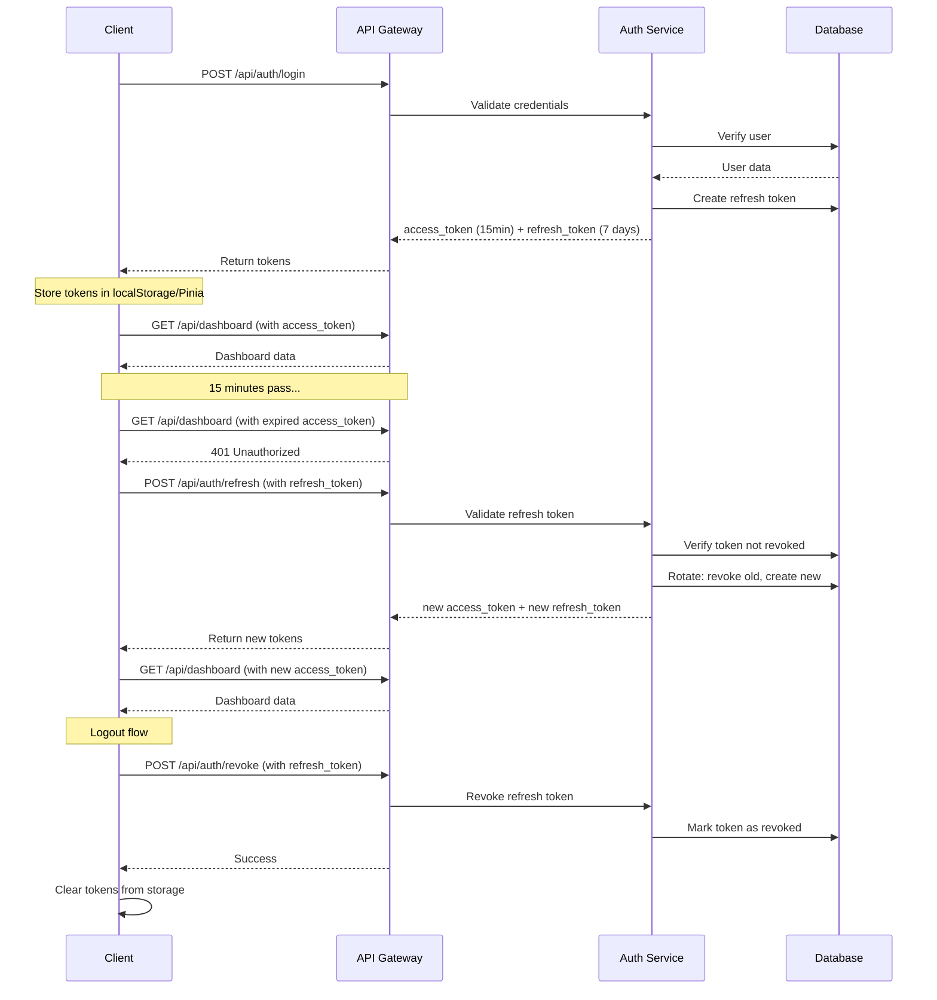

# Phase 1 Design Document

## Context

Daily Progress Phase 1 is the foundational implementation of a daily-first personal dashboard. This is a greenfield project with no existing codebase to migrate from. The system will be built as a responsive web application with a Vue 3 frontend and Bun/Hono backend, using PostgreSQL for persistent storage.

**Current State:**
- Empty repository with documentation only
- Database schema defined in `docs/SCHEMA.md`
- User flows and wireframes completed in `docs/USER_FLOW.md` and `docs/WIREFRAME.md`
- Requirements and design specifications in `docs/specs/daily-progress-phase1/`
- JWT refresh token enhancement documented in `docs/enhancements/jwt-refresh-token.md`

**Constraints:**
- All operations via API calls (no offline storage in Phase 1)
- Target individual users (no team collaboration in Phase 1)
- Mobile-first responsive design
- 2-second API response time SLA
- TDD approach required for all features

**Stakeholders:**
- Primary: Individual users seeking calm progress tracking
- Development team: Following KISS/YAGNI/DRY principles

## Goals / Non-Goals

**Goals:**
- Build complete MVP of Daily Progress with 9 core capabilities
- Implement modular backend architecture that scales to future features
- Create responsive web application with API-based data fetching
- Establish TDD workflow with 95%+ test coverage for business logic
- Deliver calm, supportive user experience (no gamification or guilt)
- Implement secure JWT authentication with refresh token rotation

**Non-Goals:**
- Team collaboration features
- Productivity scoring or gamification
- Complex project management capabilities
- Social sharing or community features
- Offline-first capabilities (IndexedDB, service workers, sync queue)
- PWA installation and offline caching
- HTTP-only cookies for token storage (Phase 1 uses localStorage)
- Multi-device session management
- Advanced reporting or analytics beyond basic history views

## Decisions

### Backend Architecture: Modular Bun + Hono

**Decision:** Use Bun runtime with Hono framework and custom modular architecture pattern similar to NestJS.

**Rationale:**
- Bun provides native TypeScript support and faster startup times than Node.js
- Hono is lightweight and optimized for edge deployment (future-proofing)
- Custom modular pattern with dependency injection ensures testability and separation of concerns
- More control than opinionated frameworks like NestJS, less complexity than building from scratch

**Alternatives Considered:**
- **NestJS**: Too opinionated, heavier weight, not optimized for Bun runtime
- **Express**: No native TypeScript, requires more boilerplate for modular structure
- **Fastify**: Good performance but less intuitive API than Hono

### Database: PostgreSQL with Prisma ORM

**Decision:** PostgreSQL for persistence with Prisma ORM for type-safe database access.

**Rationale:**
- PostgreSQL provides robust JSONB support for array fields (active_days, scheduled_days)
- Row-level security policies enable multi-tenant architecture if needed later
- Prisma generates TypeScript types from schema, eliminating type drift between database and application
- Migration support built-in with Prisma Migrate

**Alternatives Considered:**
- **MongoDB**: Less structure, no schema enforcement, harder to maintain data integrity
- **SQLite**: Not suitable for multi-user deployment, lacks JSONB query capabilities
- **Raw SQL**: Too much boilerplate, error-prone, no type safety

### Authentication: JWT with Refresh Token Rotation

**Decision:** JWT (HS256) with short-lived access tokens (15 minutes) and long-lived refresh tokens (7 days) with rotation. Tokens stored in localStorage for Phase 1.

**Rationale:**
- Short-lived access tokens (15 min) limit exposure if stolen
- Refresh token rotation prevents token replay attacks
- Refresh tokens stored in database for revocation on logout
- 7-day refresh token lifetime balances security with UX (fewer re-authentications)
- localStorage storage is simple for Phase 1; HTTP-only cookies planned for production
- bcrypt with 10 rounds provides strong password hashing

**Alternatives Considered:**
- **Long-lived access tokens only**: Higher security risk if token is stolen
- **Session-based auth**: Requires server-side session storage, more complex state management
- **HTTP-only cookies**: Better security but more complex for Phase 1, planned for production enhancement

**Implementation Reference:** See `docs/enhancements/jwt-refresh-token.md` for detailed token flow and database schema.

### Frontend: Vue 3 Composition API with Feature-Based Structure

**Decision:** Vue 3 with Composition API, TypeScript, and feature-based folder organization.

**Rationale:**
- Composition API provides better TypeScript inference and code organization
- Feature-based structure aligns with backend modules, easier to navigate
- Pinia for state management is simpler and more type-safe than Vuex
- VueUse composables reduce boilerplate for common patterns

**Alternatives Considered:**
- **React**: More ecosystem fragmentation, more boilerplate for simple patterns
- **Svelte**: Less mature ecosystem, fewer enterprise-ready libraries
- **Options API**: Worse TypeScript support, harder to organize complex logic

### API-First: No Offline Storage

**Decision:** All data fetching via API calls; no IndexedDB, service workers, or offline capabilities in Phase 1.

**Rationale:**
- Simplifies Phase 1 implementation by removing offline sync complexity
- Reduces codebase size and complexity
- Easier to test and debug
- API-based approach is sufficient for initial MVP
- Offline-first can be added in future phase based on user needs

**Alternatives Considered:**
- **IndexedDB with sync queue**: Adds significant complexity; deferred to future phase
- **Service workers with caching**: Overkill for Phase 1; PWA capabilities can be added later

### Testing: TDD with Framework-Native Test Runners

**Decision:** Bun test for backend, Vitest for frontend unit tests, Playwright for E2E.

**Rationale:**
- Native test runners have better performance and integration
- Bun test runner is built into runtime
- Vitest shares Vite config and provides fast HMR for tests
- Playwright provides reliable cross-browser E2E testing

**Alternatives Considered:**
- **Jest**: Slower, requires more configuration for Bun/Vite projects
- **Cypress**: Heavier than Playwright, slower test execution
- **No E2E tests**: Too risky for token refresh and authentication flows

### API Response Format: Standardized Sxxx/Exxx Codes

**Decision:** All responses follow `{ data, message, code }` format with S-prefix for success and E-prefix for errors.

**Rationale:**
- Consistent structure simplifies frontend error handling
- String codes provide i18n support (messages can be translated)
- Easy to identify success vs error without checking HTTP status
- Supports automatic token refresh on 401 responses

**Alternatives Considered:**
- **HTTP status only**: Insufficient for granular business logic errors
- **Numeric codes**: Harder to remember, less self-documenting

## Architecture Diagram

```mermaid
graph TB
    subgraph "Frontend (Vue 3)"
        DASHBOARD[Dashboard Component]
        PROGRESS[Progress Items Module]
        COMMITMENT[Commitments Module]
        TIMELINE[Timeline Events Module]
        HISTORY[History Module]
        AUTH[Auth Module + Token Refresh]
        SETTINGS[Settings Module]
        API[API Service with 401 Interceptor]
        STORE[(Pinia Store for Tokens)]
    end

    subgraph "Backend (Bun + Hono)"
        API_GATEWAY[API Gateway]
        AUTH_MW[JWT Middleware]
        ERROR_MW[Error Handler]

        AUTH_CTRL[Auth Controller]
        REFRESH_CTRL[Refresh Token Controller]
        AUTH_SVC[Auth Service]
        REFRESH_SVC[Refresh Token Service]
        AUTH_REPO[Auth Repository]
        REFRESH_REPO[Refresh Token Repository]

        PROGRESS_CTRL[Progress Controller]
        PROGRESS_SVC[Progress Service]
        PROGRESS_REPO[Progress Repository]

        COMMITMENT_CTRL[Commitment Controller]
        COMMITMENT_SVC[Commitment Service]
        COMMITMENT_REPO[Commitment Repository]

        TIMELINE_CTRL[Timeline Controller]
        TIMELINE_SVC[Timeline Service]
        TIMELINE_REPO[Timeline Repository]

        DASHBOARD_CTRL[Dashboard Controller]
        DASHBOARD_SVC[Dashboard Service]

        HISTORY_CTRL[History Controller]
        HISTORY_SVC[History Service]

        USER_CTRL[User Controller]
        USER_SVC[User Service]
        USER_REPO[User Repository]
    end

    subgraph "Database (PostgreSQL)"
        USERS[(users)]
        PREFS[(user_preferences)]
        REFRESH_TOKENS[(refresh_tokens)]
        ITEMS[(progress_items)]
        LOGS[(progress_logs)]
        COMMITMENTS[(commitments)]
        CLOGS[(commitment_logs)]
        EVENTS[(timeline_events)]
    end

    DASHBOARD --> API
    PROGRESS --> API
    COMMITMENT --> API
    TIMELINE --> API
    HISTORY --> API
    AUTH --> API
    SETTINGS --> API

    API --> STORE
    API --> API_GATEWAY

    API_GATEWAY --> AUTH_MW
    AUTH_MW --> ERROR_MW

    ERROR_MW --> AUTH_CTRL
    ERROR_MW --> REFRESH_CTRL
    ERROR_MW --> PROGRESS_CTRL
    ERROR_MW --> COMMITMENT_CTRL
    ERROR_MW --> TIMELINE_CTRL
    ERROR_MW --> DASHBOARD_CTRL
    ERROR_MW --> HISTORY_CTRL
    ERROR_MW --> USER_CTRL

    AUTH_CTRL --> AUTH_SVC
    REFRESH_CTRL --> REFRESH_SVC
    AUTH_SVC --> AUTH_REPO
    REFRESH_SVC --> REFRESH_REPO
    AUTH_REPO --> USERS
    AUTH_REPO --> PREFS
    REFRESH_REPO --> REFRESH_TOKENS

    PROGRESS_CTRL --> PROGRESS_SVC
    PROGRESS_SVC --> PROGRESS_REPO
    PROGRESS_REPO --> ITEMS
    PROGRESS_REPO --> LOGS

    COMMITMENT_CTRL --> COMMITMENT_SVC
    COMMITMENT_SVC --> COMMITMENT_REPO
    COMMITMENT_REPO --> COMMITMENTS
    COMMITMENT_REPO --> CLOGS

    TIMELINE_CTRL --> TIMELINE_SVC
    TIMELINE_SVC --> TIMELINE_REPO
    TIMELINE_REPO --> EVENTS

    DASHBOARD_CTRL --> DASHBOARD_SVC
    DASHBOARD_SVC --> PROGRESS_REPO
    DASHBOARD_SVC --> TIMELINE_REPO
    DASHBOARD_SVC --> COMMITMENT_REPO

    HISTORY_CTRL --> HISTORY_SVC
    HISTORY_SVC --> PROGRESS_REPO
    HISTORY_SVC --> COMMITMENT_REPO

    USER_CTRL --> USER_SVC
    USER_SVC --> USER_REPO
    USER_REPO --> USERS
    USER_REPO --> PREFS

    API -. 401 Error .-> REFRESH_CTRL
    STORE -. Token Refresh .-> API
```



## Module Structure

### Backend Module Pattern

Each module follows this structure:
```
modules/<name>/
├── <name>.controller.ts  # HTTP request handlers
├── <name>.service.ts     # Business logic
├── <name>.repository.ts  # Data access (Prisma)
├── <name>.validator.ts   # Zod schemas
└── <name>.module.ts      # Module registration
```

**Dependency Injection Flow:**
1. `ModuleContainer` registers all services on startup
2. Controllers request services from container in constructor
3. Services request repositories and other services from container
4. All dependencies are injected as constructor parameters

### Frontend Feature Pattern

Each feature follows this structure:
```
features/<name>/
├── components/           # Vue components
│   └── <Name>Card.vue
├── composables/          # Business logic
│   └── use<Name>.ts
├── services/             # API calls
│   └── <name>.api.ts
└── types/                # TypeScript types
    └── <name>.types.ts
```

### Shared: API Service with Token Refresh

```
shared/api/
├── http.service.ts       # HTTP client with interceptors
├── token.manager.ts      # Token storage and refresh logic
└── response.handler.ts   # Standardized response handling
```

## Authentication Flow

### Token Lifecycle



### Frontend Token Refresh Logic

```typescript
// HTTP Service Interceptor
httpClient.interceptors.response.use(
  (response) => response,
  async (error) => {
    if (error.response?.status === 401 && !error._retry) {
      error._retry = true;

      try {
        // Attempt token refresh
        const newTokens = await refreshToken();

        // Update stored tokens
        tokenManager.setTokens(newTokens);

        // Update Authorization header
        error.config.headers.Authorization = `Bearer ${newTokens.accessToken}`;

        // Retry original request
        return httpClient(error.config);
      } catch (refreshError) {
        // Refresh failed, redirect to login
        tokenManager.clearTokens();
        router.push('/login');
        return Promise.reject(refreshError);
      }
    }
    return Promise.reject(error);
  }
);
```

## API Endpoint Design

### Response Format
```typescript
// Success response
{
  data: { /* actual data */ },
  message: "Human-readable message",
  code: "S003"
}

// Error response
{
  data: { details?: any, field?: string },
  message: "Human-readable error",
  code: "E002"
}

// Paginated response
{
  data: {
    data: [ /* items */ ],
    pagination: { total, perPage, currentPage, lastPage }
  },
  message: "Retrieved successfully",
  code: "S003"
}
```

### Authentication Endpoints

| Method | Endpoint | Description | Auth Required |
|--------|----------|-------------|---------------|
| POST | `/api/auth/login` | Authenticate, receive access + refresh tokens | No |
| POST | `/api/auth/register` | Create new account | No |
| POST | `/api/auth/refresh` | Exchange refresh token for new token pair | No |
| POST | `/api/auth/revoke` | Revoke refresh token (logout) | No |
| GET | `/api/auth/session` | Validate session, return user info | Yes |

### Key Endpoints (Protected)
- `GET /api/dashboard` - Get today's dashboard data
- `GET /api/progress-items` - List with pagination
- `POST /api/progress-items` - Create new item
- `POST /api/progress-items/:id/logs` - Log progress
- `GET /api/commitments` - List commitments
- `POST /api/commitments/:id/logs` - Log commitment activity
- `GET /api/timeline-events` - List events
- `GET /api/history/today` - Today's progress
- `GET /api/history/week` - Weekly summary
- `GET /api/user/preferences` - Get user settings
- `PUT /api/user/preferences` - Update preferences

## Database Schema Highlights

### Key Design Decisions

1. **JSONB for Array Fields**: `active_days`, `scheduled_days`, `days_of_week` stored as JSONB for efficient querying and flexible day selection

2. **Foreign Key Cascades**: All foreign keys use `ON DELETE CASCADE` to ensure data consistency when users delete accounts

3. **Status Enums**: Simple string fields ('active', 'settled') for status, allowing easy extension to 'paused' in future

4. **Timestamp Fields**: `created_at` and `updated_at` on all entities for auditing

5. **Separate Log Tables**: `progress_logs` and `commitment_logs` are separate tables to support unlimited history without bloating main tables

6. **Refresh Token Table**: New `refresh_tokens` table for token rotation and revocation with `revoked_at` timestamp and `user_agent` / `ip_address` tracking

### Refresh Token Table

```prisma
model RefreshToken {
  id        String   @id @default(cuid())
  token     String   @unique
  userId    String   @map("user_id")
  expiresAt DateTime @map("expires_at")
  createdAt DateTime @default(now()) @map("created_at")
  revokedAt DateTime? @map("revoked_at")
  userAgent String?  @map("user_agent")
  ipAddress String?  @map("ip_address")

  user User @relation(fields: [userId], references: [id], onDelete: Cascade)

  @@index([userId])
  @@index([token])
  @@map("refresh_tokens")
}
```

## Risks / Trade-offs

| Risk | Mitigation |
|------|------------|
| localStorage XSS vulnerability for JWT tokens | Phase 1 simplicity accepted; documented for production enhancement to HTTP-only cookies |
| Token refresh timing may cause race conditions | Implement request queuing during token refresh; prevent multiple simultaneous refresh attempts |
| Refresh token reuse detection | Each refresh token can only be used once; old token immediately revoked on refresh |
| Network errors during token refresh | Clear tokens and redirect to login; user must re-authenticate |
| No offline functionality | Users require internet connection; acceptable for Phase 1 MVP; PWA capabilities can be added later |
| Single-device assumption | Refresh tokens are device-specific; users must log in separately on each device |
| 15-minute token lifetime may be too short for some users | Automatic refresh is transparent; balance between security and UX |
| PostgreSQL schema migrations in production | Use Prisma Migrate with rollback strategy; test migrations in staging first |
| Timezone handling complexity | Store all timestamps in UTC; convert to user timezone in application layer |

## Migration Plan

### Development Deployment
1. Initialize PostgreSQL database via Docker Compose
2. Run Prisma migrations: `bunx prisma migrate deploy`
3. Seed test data for development
4. Start backend: `bun run dev`
5. Start frontend: `cd repos/frontend && bun run dev`

### Production Deployment (Future)
1. Run database migrations in staging first
2. Verify data integrity with smoke tests
3. Deploy backend code (blue-green deployment)
4. Run Prisma migrations in production
5. Deploy frontend code (CDN with cache busting)
6. Monitor error rates and response times
7. Rollback plan: Revert to previous deployment, use database migration rollback if needed

### Rollback Strategy
- Backend: Revert to previous container image
- Database: Use Prisma migration `down` command if schema changes were applied
- Frontend: Revert CDN deployment, clear cache headers

## Open Questions

1. **Token Refresh Rate Limiting**: Should we limit refresh attempts per IP to prevent abuse? Decision: Implement basic rate limiting for `/api/auth/refresh` endpoint.

2. **Notification Delivery**: What service will be used for daily reminder notifications (email, push, in-app)? Decision: Deferred to Phase 2; no notifications in Phase 1.

3. **Data Export Format**: Should user data export be JSON, CSV, or both? Decision: JSON only for Phase 1; CSV in Phase 2.

4. **Password Reset Flow**: Should password reset use email links or security questions? Decision: Email-based reset deferred to Phase 2; admin-only password reset in Phase 1.

5. **Deployment Platform**: Where will the application be hosted (Vercel, Railway, self-hosted)? Decision: Self-hosted with Docker for Phase 1; cloud platform evaluation in Phase 2.

6. **PWA Addition**: When should offline capabilities be added? Decision: Evaluate user feedback after Phase 1 launch; prioritize based on demand.
